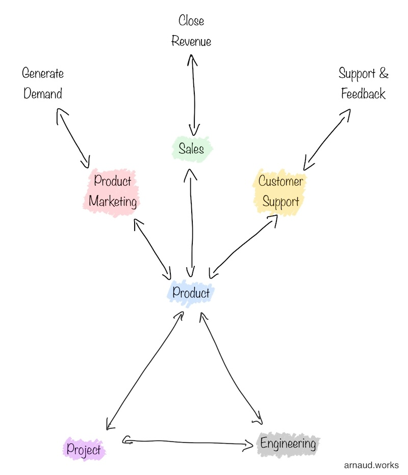

# The Pirate's Way
<baseline>How to build tech products and the teams behind them</baseline>


## [Read Me First](#readmefirst)
### [Disclaimer](#disclaimer)
### [Path to Success](#pathtosuccess)
### [Take-Away](#takeaway)

## [Concepts & Principles](#conceptsandprinciples)
### [Company's DNA](#companydna)
### [Trifecta](#trifecta)
### [People First and Last](#peoplefirstandlast)
### [Leadership vs Management](#leadershipvsmanagement) 
### [The Bozo and the Golden Goose](#bozoandgoldengoose)
### [Politics & Culture](#politics_culture)
### [Motivation & Inspiration](#motivationandinspiration)
### [Time is everything](#timeiseverything)
### [Mindset beats Skills](#mindsetbeatsskills)
### [Fear the Fear](#fearthefear)
### [Knowledge is everywhere](#knowledge)
### [Cui Bono](#cuibono)
### [Owning the Zone](#owningthezone)
### [Product Sweet Spot](#productsweetspot)
### [Focus](#focus)
### [Product, Program, CX, CS and Delivery](#product_program_cx_cs_delivery)
### [The Process Love Affair](#process_love_affair)
### [UX vs UI](#uxvsui)
### [Recruitment & Team Structure](#recruitment_team_structure)
### [Roles, Titles and Individuals](#roles_titles_individuals)
### [The Loneliness of the Winner](#loneliness_winner)
### [The Remote Playbook](#remote_playbook)
### [Making Hybrid Work](#making_hybrid_work)
### [Feature/Application Matrix](#feature_application_matrix)
### [The Impossibility Equation](#impossibility_equation)

## [The Product](#theproduct)
### [R&D](#randd)
### [MVP](#mvp)
### [GM](#gm)
### [The never ending product](#theneverendingproduct)

## [The Team](#theteam)
### [Individual contributor](#individualcontributor)
### [Manager](#manager)
### [Director](#director)
### [VP](#vp)
### [C suite](#csuite)
### [Founder](#founder)

## [Make it your own](#makeityourown)

[pagebreak]

@#$readmefirst$#@
## Read Me First

Let's address the title. 

When it comes to build tech teams, the attitude I like to promote is the one of people who are fearlessly navigating the metaphorical sea of high/deep-tech believing in their ability to handle new challenges on a regular basis.
To do so, they develop the skills and the mindset to set their own rules, challenge the status quo and in the process accomplish things that were out of their reach before.
I call people who work this way, pirates. It's a mark of respect anchored in the old definition of hackers that started this entire industry ~50 years ago.

Now, what you're getting into. 

I've developed my methodology over the past ~20 years (and counting) working on very diverse environments building tech products. 
I've made countless mistakes, picked countless ridiculous battles and died on the dumbest hills you can imagine.
But along the way, I've also learned from my mistakes, met incredible people, learned from them and came up with a set of skills that allows me to tackle any tech product problem with confidence.

I've never put anything that would collect all these lessons together, as it was a very personal "playbook" I would only use when coaching or mentoring my staff, friends or clients.
This is because for me, most of this methodology is mostly build off pieces widely covered and available online for free.
At times, I thought it'd be good for me to have a reference somewhere, but still, I never pulled the trigger.

In the past few years, the demand for me to put something together has only increased in frequency.
I used to respond that it's all online. Gave a few names and left it to that, but I got convinced that my specific composition is like a recipe: having access to the ingredients doesn't take away the value of the steps to bake the cake.

So here we are, this is the most detailed material I have ever written on my methodology to **build tech products and the teams behind them**.

@#$disclaimer$#@
### Disclaimer
I'm not a writer and not trying to be one. The style here isn't going to be mind-blowing and english isn't my native language.
My objective is to convey the knowledge I've acquired in the most succinct way.
I'm not a fan of long read with little meat to it, so I'm going to cut to the point as often as necessary. 
There is a lot of depth at times I will cover and the most important nuances lie in them, so bear with me when I take a tangent.
Ultimately, for the sake of efficiency, convenience and brevity, I will be making definitive statements throughout this content.
Remember, that everything here is implicitly wrapped with "in my opinion" and "in my experience". Don't take things too personally.

@#$pathtosuccess$#@
### Path to Success
Success isn't as straight forward as it's commonly portrayed. I'm sure you've seen this meme around:


This isn't the place to cover success as a whole, but it's important that you take a look in the mirror and find what it means to you.
Regardless, this book isn't about making you successful. It's about sharing the tools that allowed me and my teams to be successful under our own criteria. 

What drives me is building things. As big as possible, as fast as possible. I'm very curious and easily interested.
The more out of my comfort zone I am, the better, as it will present the best opportunity to overcome difficult problems and learn from the journey.
The collaboration between people, the personal growth of the individuals under me/next to me and overcoming things we didn't know were possible is my definition of success.
It's the high I chase, the satisfaction I take home. 

Find your own, this book won't do it for you.

@#$takeaway$#@
### Take-Away
Entering any material, I think it's important you have a success criteria. This applies to many other situations but in this one, what you should take away from this methodology is:

1. A renewed **interpretation of concepts** you may already be familiar with.

2. A set of **principles** that structures your operations all the way to the day to day.

3. A set of **processes** that will help reinforce the principles in a practical tangible way.

All these will shape your mindset. It won't be the end of the journey, but the beginning.
Keep in mind that knowing the path and walking the path are two very different things.

@#$conceptsandprinciples$#@
## Concepts & Principles

Let's start by covering concepts and principles. It will feel like a bit of a dumping ground, but you can come back to it in depth when I go over the product and team parts later.
Also, I wanted for this section to be closer to an encyclopedia. A place you can come back to on a regular basis without having to start from the beginning to be anchored in a story or a flow.

**Principles** are high level rules you force yourself to follow. Guidelines in your life that keeps you on the right tracks. They aren't binary hard lines. 
It's more a 90% of the time hard, 10% soft; on exception cases. 
This hard-ish stance is not to dumb your brain into following them like your new religion, but to force you to think if you're facing an exception when they get challenged.

**Concepts** are more relatable. Here, they mean topics reviewed from a different angle. Often an unpopular one (mostly on the statistical sense).
You may not like what you will read because you don't know me, don't know where I come from (intellectually and emotionally) and - at times - I completely flip some of these on their head relative to what you've probably been told for years and likely have come to deeply believe.

In the end, you're likely to end up taking either one of two paths. You'll either think I'm an idiot or you'll love what you read. It's never been in the middle somehow.
This is rule #1 in leadership (we'll get back to it), whatever you do, you will never be compatible with everyone. 
If you can't stand being hated, you won't be able to accomplish anything of significance.

Let's dive into it.

@#$companydna$#@
### Company's DNA

A company's DNA is the most important thing to understand as early as possible. It's not always easy for private or unknown companies to figure out, and you may have to be inside the factory to see how the sausage is made.
Regardless, it will shape everything from the smallest detailed decision to the highest strategic one. It's often confused with culture but the DNA creates most of the culture, not the other way around.

I've seen this principle apply time and time again. I've been fighting company's DNA to some extent in pretty much every company I worked for.
It gets particularly difficult when the executive team is saying they are committed to a direction but their DNA is acting against it. 
Now this is super common in time of hardship. The team wants to shake things up, but won't let go of their old ways, not realizing why. 
It's hard as well to cover because at the highest level, most people believe their success is due to their impeccable professionalism, their ice-cold rational and whatever makes them feel that everything they have is earned and luck had no play in it.

This DNA won't stop at this level though. It will express itself from every level of the company because many, if not most of the staff, is here because of that DNA - even if implicitly.
It usually translates in symptomatic expression of the DNA. For instance, people will want to work at the company because it has "a strong office culture" which in fact is only the expression of the micromanaging DNA the exec team is pushing.
There are plenty of valid reasons to have a full in-office workforce beyond micromanagement. That's not the point here.
The point is that the micromanaging DNA behind the office culture will express itself much further than the office culture. And you now may have to push against a secondary 'echo chamber' of that DNA with the work force defending it.

[pagebreak]

The company's DNA is the core principle that the team will always fall back to. 
It will be the core interests they have; the rules they obey by all means; the elements that ultimately defines their **identity**.
It's not always written in black and white. It's not always aligned with the advertised values. 
Most of the time, the values are an aspiration. A direction the team would want the DNA to be at.

It comes first and foremost from the founders.
If the founding team is non-technical, it can create a DNA of business first. 
This can translate into a DNA that diminishes the fine print difficulties of product and engineering - most typically the schedule slipping - and ultimately adds frictions to everything while it becomes very difficult to explain the situation up.
On the other side, a technical founder can bring to the table a "Engineering can do it all and I know it all" attitude and a strong preference for a given product line or market shaping the DNA of the company towards consumer electronics for instance and preventing a differentiation effort towards enterprise (or vice versa).

The next echo chamber is the executive team. They will most likely carefully mold themselves to please the founders through meticulous upward management.
Very, very often, the executives will aggressively, yet subtly nudge the DNA towards where the company can be the most fruitful. It may work (Steve Jobs being convinced by his team to do iPod on Windows) or it may fail. 
It's not uncommon to see exec move on to their next venture when they fail at this task. I've been there and I know many who have been there as well.

Then it is quickly followed as an echo chamber by what the company does, where it became successful. You'll hear conversation saying "We are X because product Y is our most successful one".
For instance, I heard many times regarding Apple: "We are a mobile company because all our best-selling devices are mobile devices."
And it's a truthful statement, because what you sell heavily defines your identity and your DNA. 

Now you've probably seen this circulating on social media:


Take a second and think about what's the DNA of each of these companies? Are their side businesses defining their DNA or just side-gigs?

[pagebreak]

Unfortunately for the idealist, a company is extremely unlikely to be able to develop multiple DNAs (Definitely possible). 
This a broader topic I don't want to cover here, but conglomerates and acquisitions with retained autonomy (think of YouTube inside Alphabet) are valid paths towards it maintaining multiple DNAs. 
On the other side, when you try to force two DNAs to merge, because it's unlikely to work, you can find strong clashes - like the recently reported issues between Slack and Salesforce.

Understanding the DNA and embracing its strength and limitation is critical as you will see that an important principle here is to constantly navigate just outside the boundaries of the possible. 
You want to be able to push everything forward in a realistic way, never delusional.

The alternative is a long series of arguments, deceptions and burnout. 

@#$trifecta$#@
### Trifecta

The trifecta is a work model - a core principle - that sets expectations, responsibilities and dynamics to build products effectively.
As it's name implies, it's structured around **three roles** that are defining the **product, build it and deliver it** on time.


#### 1. Product - What?

Product is here to **figure out what should be built**. They answer the question **'What?'**.

There is a process-y way to go at this, but many companies (small and big, young and old) are being very successful with an organic approach, so it's not mandatory.
Don't torture yourself if you don't or can't do all the things below.

Here are some of the ways the Product role can find the answers to 'What?':

- **Market research** - Gartner quadrants, market analysis firms/reports, you name it. This is high level and frankly the company should have done this pre inception and maintain it up to date once in a while.
- **Product Marketing** - Customer surveys, usage analytics analysis, new revenue streams; anything the marketing team has collected in terms of next milestone. This or some of this can often be taken by product managers.
- **CS/CX (Customer Support/Success & Customer Experience)** - Not everyone has them, but if you do, they are often part of product, but they are strategically positioned to receive customer feedback on what works and what doesn't. Beware of the survivorship bias though.
- **Stakeholders** - Any other key stakeholders that has a problem, an interest and/or a demand. Can be operations, accounting, finance, compliance, and any of the other roles of the trifecta. Everything should be researched and validated.
- **Vision** - Now this is usually the part that everyone prefers. You YOLO ideas that make you feel great on reshaping the world as we know it. The less cynical way to look at it is, that this is the area where you define what the customer will want as they don't _trully_ know what they want. It is easily 80% of the work when working on bleeding edge technology (deep tech). Very often, this comes from the founders, expanding by product leadership and through a back and forth with the different product leaders in the org.

There are more ways of course. They will depend on the structure of influences in the company and which departments have a support or control function.
Regardless, successful outcome is a product line up, release structure, feature list with impact rankings and a lot of story telling.

#### 2. Engineering - How?

Now that we know what we want, it's time to work on building it. The engineers will do that by answering the question **'How?'**. 

Engineering will do just that while retaining the most important elements from Product.
This also means that the requirements from Product have to be sensible. To enforce this, the **Trifecta works _with_ each other, not _for_ each other**.
This is a critical differentiation of the trifecta vs what you've probably heard before from structure that resembles it.

To figure out 'How?' Engineering will go and look at:

- **All stacks, Technologies and/or Providers** - Which language? which framework? Full native? Web? Firebase vs AWS? AWS vs Azure? Self-hosted? Bare metal? Contractors for dev work? Do we use Atlassian? Testrails for our QA?
- **Code base state** - Is this a pit? What is a code debt nightmare? What's a house of cards? What's the perfect API-based engine we have that can scale to infinity?
- **Skill set** - What skills do we have at what level of maturity?
- **Load and capacity** - Do we have enough high skilled people available to work on said work? If so or not, what's the rough timetable (Project will help here)
- **Current recruitment market conditions** - Consulting with HR, you get a sense of your upward expansion in talent to beef up? What's our turnover to have a new hire productive? How much of this is related to our stack?
- **Team dynamics** - What team is critical for the product dev? Are they up to speed? Are they at the right level of maturity?

Their decision-making may require architecture meetings, exploratory R&D and definitely iterations.
Ultimately, the success outcome is a multi-generational plan on how to balance new features, core technologies development and refactoring. (It goes deeper but not relevant here)

#### 3. Project - When?

The Project role has often other names like delivery and program management. There are differences noticeable but at the role level they don't matter.

Anyway, we finally know what we want to build and how we will build it. It's time to figure out **'When?'**. 

At this moment, Engineering is capable of giving time frames but these are notoriously unreliable.
That's because to provide accurate timeframe, you need perspective.
I'll go in the details later, but in a nutshell, you need some distance to see the entire picture and a certain detachments from outcomes.
This is functionally incompatible with what engineering needs: depth, focus and commitment.

Project isn't deciding how long something takes. Project allows Product and Engineering to come up to compromises by being a grounded sounding board to all dependencies at hand.
That's also why in mono-products like a single iOS app, you rarely need a project manager. Engineers will easily assume the role and do it well.

In bigger settings, Project coordinates all work from the individual teams to the cross-functional collaboration - sometimes with external stakeholder - it gets to see the entire dynamic at play.
Every meeting is an opportunity to identify conflicts in promises ("you said that..."), expectations ("I thought ...") and responsibility ("I didn't know I was supposed to ..."); to make sure the progress is capture appropriately; to lay the work on roadmaps and timeframes.

Project is often the most powerful when it is the full owner of the project management tooling (Jira and alike). 
They work to continuously polish the process in place as to make sure every team speaks the same language.

Project will often either drive a meeting when there is a peer-to-peer coordination using soft skills. Project isn't the boss in the room, Project just wants information to be accurate.
Regardless of who runs the meeting, if Project is involved, it will act as a minute taker. They will then communicate to everyone the outcome. It's an important step that realigns everyone.

In a nutshell, Project can build the path to figure out 'When?' by:

- **Attend all stand-ups** - It gives it direct insight in how engineering is working. Direct opportunity to raise upcoming conflicts and issues
- **Run regular sync up with Product and Engineering** - This is to realign all expectation with the latest reality.
- **Kick off new work** - To make sure everyone is starting from the same point.
- **Own the project manager tooling** - To define and maintain the engineering workflow language across all teams. You don't want 10 teams with 10 different ways of working.
- **Communicate & document** - To set where timeframe are available and make sure everyone is working under the same expectations.

Ultimately, this work gives the answer to when will the work be done. And when done right, the successful outcome is information that is available at any given time with minor update delay (< 3 days).

[pagebreak]

The Roles aren't necessarily matching 1 to 1 with people. 
In smaller companies, theses are hats that a single or more people wear. 
In large entities, it's easier to have full departments behind these roles.

For the trifecta to be effective, you need to promote a healthy back and forth between the roles.
This is essential to adjust to the other roles' harder lines they may face.

As a rough schedule you can use is:

- Product <-> Engineering should meet once a week or every two weeks.
- Product <-> Project should meet once a week.
- Engineering <-> Project should meet daily or multiple times a week. Ideally, Project has people to be at daily stand-ups.

Last, remember that these roles don't report to each other. They are peers working together towards a common goal. 
They all need to carry their own weight, so they all can do their individual work. They all depend on each other.

@#$peoplefirstandlast$#@
### People First and Last

Tech companies are built by people. Smart and creative people. Usually relatively more people than you would need in other companies because most of the automation other industries enjoy comes out of tech companies.
There is plenty of automation and improvements in tech companies, but it's a bottomless pit as all these tools either require more people to manage or simply provide a platform to the next round of problems.
Software is like that - and yes, hardware companies runs tons of software too, so they are on the same boat. 
Software is this infinite land that continuously expand past the point that anyone can mentally picture.
So you're forced to bring more and more people as you grow, so you can continue developing and maintaining your products.

Not only the surface is large, but the problems are very complex. Even if your product is simple, as it grows you'll inevitably need to segment it just to be able to maintain it.
This requires creating an architecture that rely on smaller pieces that interact with each other. Just so you can focus on the individual context of each piece.

You may be thinking that you can just keep your business small, but you take the chance of being swallowed by the competition.
Either nicely through an acquisition or nastily through irrelevance. This reality makes the push to grow an omnipresent force.

It's not the end of the world, but it's a dynamic you better get comfortable with. 
Usually, people close to engineering are well aware with this, but there is a new generation of tech leaders whose background isn't necessarily rooted in engineering.
These people tend to have a hard time to understand that every line of code you have is a liability you need to maintain.
They also tend to have a hard time accepting that code kinda ages like milk.

These two realities forces you to constantly rewrite what was written. 
The efficient way to do it is to leverage the people who know the code base in the first place as they carry with them the knowledge of the lessons learned building and shipping the product.
It's not a silver bullet though as some of them can stay stuck in the old ways.

Regardless, your people dynamic is now a **qualitative**, **quantitative** and **generational** (at the company level) problem to handle.

[pagebreak]

By now, you probably get that my point is that people in your teams are incredibly important. 
This doesn't mean that you have to accept everything and anything, but it does mean that you **have to go above and beyond** to find resolutions, to stimulate the environment they work in. 
You have to leave behind your ego, feelings and assumptions behind. You have to put yourself in their shoes.

- In situation of under performance, you start asking why? You assume there is a legitimate problem. Read more from Simon Sinek if you want to deep dive this topic.
- In cases of conflicts, you focus on getting all sides perspective first. You protect fairness, leave your 'favorite child' biases behind.
- In any circumstances, you focus on providing perspective so everyone understand why they are here. You put yourself in their shoes.

A practical example that's also been widely documented is founders/executives with heavy equity in their compensation not understanding/accepting low engagement from their staff.
They don't have the same skin in the game as you have. Give it to them or just accept the dynamic you've established.

[pagebreak]

Finally (for now), tech talent has the upper hand. They are in high demand pretty much everywhere in the world. The good ones even more. 
They get approached all the time with new opportunities and that's another dynamic you need to get comfortable with.
Once again, it doesn't mean you have to accept everything and anything. It does mean you need to understand the true nature of your relationship.
The large majority of them don't want to job hop every few months. They want to be paid fairly, work on interesting problems in an environment that is pleasant and compatible with their personal development.

Just don't give them a reason to leave. Give them a reason to stay or join.

Eventually, you will have fostered and cultivated a group of exceptional individuals that will take care of the complexity, size and evolution of your tech products, because if you take care of your people, they will take care of your products. 


At this point in my career, I have worked for many companies with broken products. This was the mission. This was the focus of the CEO/Founder.

I told them then what I want you to retain: **Fix the team, they will fix the product.**

@#$leadershipvsmanagement$#@
### Leadership vs Management

The difference between leadership and management is a subject I particularly appreciate. 
They are so often used as synonym and the term 'lead' is so commonly used as a blanket placeholder to rightful titles in insecure environments.
Still, there are _very_ big differences that have to be understood to **build world-class teams**.

[pagebreak]

#### Management is the Art of Creating Predictable Results

To achieve predictable results, the manager (at any level) leverages **different processes and tools** that have demonstrated - in their context - their ability to do so. 
This includes scheduling, workflows or pipelines with checkpoints at given key frames. 

Anyone can basically be a good manager providing that they can structure their work and be organized. You simply have to engage in a control loop:

1. Start by identifying a **problem**. This is obviously easier if you've done the job below the manager, but it shouldn't be crazy hard either way.
2. You continue by figuring out a **solution**. This is a research project. You can get answers from the internet, your network, personal experiences or brainstorming.
3. You deploy the solution and **observe** the results. This is simply organization and discipline. There are ways to get better at each of these steps, but I'll cover that later.

After that last step, based on the observed results, you go back to step 1, moving to the residual problems. Rinse and repeat.

Great managers get good at predictable results, but the tech industry being such a talent-driven one, if you are looking for excellence, a pure management approach tends to fall short. 
This is where leadership comes in.

[pagebreak]

#### Leadership is the Art of Guiding Others to their Excellence

Everything else that is usually attributed to leadership is consequential to this. People follow their leaders when they convey their ability to guide followers to a better situation.

Leadership is about bringing **inspiration and direction** to a bright future while also providing **individually-tailored guidance and support** to get there.
In other words, you set the north star, get people rallied behind your ability to take everyone there and take care of each individual along the way.

It's more difficult than management because it requires strong **soft skills**. You have to be confident and capable to put yourself in your people's shoes. 
You need to be able to genuinely connect with the people you interact with to effectively lead. You need to genuinely care about them.

In practice, the rise of leadership skills is rarely structured and much more often natural selection oriented. 
Many strong leaders have a natural sense for their style and this tends to create a matching 'natural selection' where you - as leader - attract people that are compatible with your style and reject those who aren't. 
This is something you should be aware of as you will be missing on some incredible talent and ideas if your style is aggressively discriminative.
There are countless leadership style; each with its own discriminative nature as you will never be compatible with everyone.

Leadership is not only natural though, it can be learned. It is a longer and more difficult journey than management because it requires you to do a lot of work on yourself.
That is, if you want to excel at the task, which is definitely not the majority of leaders out there.
Even notoriously famous leaders that have achieved great goals tend to exhibit a version of 'walk or die to my style' attitude.
It does work, it's hyper discriminative, so you should aim higher and be better.

Great leadership requires:

1. Strong **soft skill** - Social awareness, communication, listening -, 
2. The ability to **connect with people**, 
3. A sense of **confidence** without losing the ability to **question yourself** constantly.

Leading by example is an obvious step you have to follow. If you live by "do what I say, not what I do", you will lose respect of everyone faster than you can blink. This doesn't mean you need to do everything yourself first either.

Ultimately, if you are capable of providing the right level of guidance and support to your people, you will start seeing that the people you work with are giving you **a lot more** that what you'd have under a plain management structure. 
I'm talking **better, fresher ideas; an always switch-on attitude; a stronger internal drive; positive/can-do attitude; loyalty and commitment; and so much more**. 
Also, this energy is **contagious**. As you now lead a team of people who are inspired to take on the impossible, you attract better talent too.

Good leadership is the number one differentiator between teams who do excellent, pioneering level of work and those who just run a decent product/company. 
I'd choose a poorly managed company with great leadership against the opposite any day. 

[pagebreak]

#### Leadership and Management Throughout your Career

As you climb the ladder on the people management style, the importance of leadership and management changes.
Even at the individual contributor level, management and leadership skills matter, but they are a 'nice to have', so I'm not going to dive too deep into it now.

At first, as a manager, you'll need a quite high 'great management skills' to 'great leadership skills' ratio. This is because your job is first and foremost to organize the work of the people underneath you.
As you progress, the balance progressively shifts because you have more and more people underneath you that are handling the management and the expectations shifts towards autonomy and the ability to take on higher and higher level requirements.
At the top, you are becoming 'one of the few'. You must be inspiring, you must convey the energy that is making the top of the list of reasons as to why people join and stay.

In a nutshell, it kinda follows this graph:


[pagebreak]

As you can see, the difference matters, because it's two sets of skills that needs to be worked on independently. 
If you believe there are the same, you are likely not to work on both but simply the one that you think represents both in your mind.

@#$bozoandgoldengoose$#@
### The Bozo and the Golden Goose

There are countless types of personas in a company and just as many ways to describe them with more or less colorful metaphors.

Just like many people, I've attended team building workshops that had a component of personality analysis. 
At this point in my career, I find these workshops to be basically group therapy sessions and the personality profiling output as useful as a horoscope.

Profiling your teams is still useful as a way to build a **tailored support and development system**. 
On the other hand, putting people in buckets is a horrible idea that creates, for everyone, a **sense of finality due to their newly discovered immutable identity**.

I'll cover the whole concept of identity and its perverse effect in another chapter though.

For now, there are two types of people that I think are worth discussing, identifying and handling correctly: **The Bozo and the Golden Goose**.

When I use these terms, I am not describing the whole identity of these individuals. I'm describing a set of behaviors in a given context. 
This is important to grasps because as you relate to this, as you find Bozos and Golden Geese in your surrounding, you'll likely come to think something along the line of "X is a great person when we do Y".
The two aren't incompatible, so let me repeat: I am not defining identity, I'm describing a behavior in a given context.

Quantitatively speaking, these two types aren't representing any majority in any company. If anything, Bozos may account for 5-10% at most of the group. 
Golden Geese are incredibly rare, that is also compounded by the fact that they tend to be hidden by Bozos. Count yourself lucky if you have a Golden Goose in your company.

Still, they do matter a lot because their impact is defining for the team, the product and the company.


#### The Bozos

There is a very [famous article that covered Bozos](https://www.forbes.com/sites/ericjackson/2012/01/31/why-every-company-needs-a-no-bozo-policy/) and cemented the term, but the definition there and the explanation for me is lacking depth.

The Bozo as defined in this article is someone who thinks they are smarter and more competent than they actually are.

I think the article makes the critical mistake of adopting a tone that diminishes two things: the skills and the impact of the Bozos.

Bozos aren't dumb people that landed top jobs by chance. Most of them are master manipulator and master social engineers - even though there is a range of skills in Bozoland. 

They are insanely good and fast at identifying the dynamic at play in any given group, developing a path of least resistance that will ultimately and unequivocally push them to a position that will profit them at any costs to the rest of the team/company.

They use advanced level of intimidation, courting, gas lighting and control structure to channel the flow of information to their benefit.

They don't just hire more Bozos, they actively push out top performers they can't control or place in a situation where they can claim these top player's achievements as theirs.

They leverage the human need for blending the lines between work and friendship to their advantage. 
You will catch them talk ill of their boss while at the same time spending every week with them at a bar, golfing or other activity.

My point is they are smart and active rather than dumb and passive.


Incompetence itself is only a temporary state of a given individual. As a matter of facts, most of the people that delivered incredible things were completely incompetent at the beginning of the journey.
Their attitude though, even if adopting some sense of 'fake it until you make it' is to figure it out and progress to push the common goal.

For instance, you can look at the recruitment material from Apple when they promoted how they figured out magnets out of complete ignorance before mastering them in most of their products.


The Bozo is different in the sense that it has no desire to skill up in a hands-on way. The Bozo wants to continue on a manipulating journey.
For the Bozo, the **end justifies any means**, and the **only end that matters is their personal, selfish gains**.
This is this attitude, this mentality, this craft-level execution of it that defines what a Bozo truly is and their true damage potential.

There are many ways a Bozo can hurt a company and its people, but out of all the negative things they can do, the worst is what they do with the Golden Geese.

They focus a lot of their attention to keep these exceptionally performant people out of the spotlight as to harvest all these 'eggs' and claim them as their own.

#### The Golden Goose

The Golden Goose is the type of person who perform so insanely well that when you describe the effort and/or the output, 99% of people think you're lying or exaggerating.

I'm not talking about that one person that saved the day when production went under. 

I'm talking about the person that worked 18h a day, 6 days a week for 6 weeks to close the shit show of collections. 
I'm talking about the engineer that came in and **delivered three times as much on its own than the previous team of 5 in half the time**.
I'm talking about the manager who unlocked the program that's been dead in the water for 3 months in one meeting.

(These are all true stories)

I have met and worked with a lot of Golden Geese. Many of my closest friends are Golden Geese. I married one. 
It would be really hard for me to convince you there is no biases when I say this, but my wife is in a league of her own in the Golden Geese olympics.

You can take it to the bank when I say **these people aren't replaceable**. 
When they are gone, you will definitely either accept a much lower output, a much bigger team or more likely both. 
If that's your definition of replaceable though, then I guess a horse is a replacement for a truck too.

Protecting and enabling them is obviously incredibly important.

Most Golden Goose has no realisation of their performance level. They have a deformed sense of what's acceptable and live by a strong sense of principles that is tightly connected to their identity.
For them, it's just inconceivable not to do it right, to let the team down, not to deliver what's expected, etc.

This is where the Bozos tend to come in. They sniff this out extremely fast, put the Golden Goose in a world of their own making, and make sure they are the one defining the rules of this world.
For the Goose, **it's like being plugged into the matrix**, the Bozo is harvesting the energy and claiming it theirs.

The end result is always the same, severe burn out, depression and life-changing decisions for the Geese. 
I've been in these conversations countless times, it is devastating to see such top performers getting their life force sucked out for such selfish outcomes.

#### Handling

I despise mediocrity. It's a topic on its own, but in a nutshell, I tend to have a good idea of what could be achieved without the noise of selfish interests (mediocrity). 
Golden Geese are bringing the cheat codes to the pursuit of achievements and seeing them exploited or dismissed pisses me off. It's been the drive for me to stick my neck out and defend them.

Few people know how terrible I was at writing and speaking growing up. I was copiously mocked by my teachers and my classmates. I had no desire to be in the spotlight.
Still, I picked up public facing positions because the Golden Geese I was working with didn't have anyone representing them, carrying their voice. 
In the same time, the other side's Bozos were bashing them as loud as they could.
I was called all sorts of things, threatened, along with a collection of joyful things I can't talk about for doing this, because that's what Bozos do.

In private settings, I put my role in jeopardy for Golden Geese to have a chance to show their skills. 
Ultimately, they delivered and my judgement was acknowledged, but I always remind everyone that I did nothing, they did the work.

I've coached Golden Geese directly to provide them perspective and data behind their capabilities (acknowledgement & sense of normality), while at the same time helped them develop self awareness about their effort to protect against burn out (self-preservation).
I've crafted step by step plans and stayed in the shadow for them to reclaim the recognition of their effort. I've pick up the battles behind closed doors to defend their reputations, skills and positions.

I think you can see where I am going. I'm not about to promote something I don't do.

As a tech executive, you aren't here to shine for doing everything. **You're here to bring the right people in and create the structure/environment that makes them shine.**

I can tell you that you will suffer from executing this way though. Some of your superiors will not appreciate behind the scene work and will constantly have a biased recognition toward visible shiny things.
Manage this as much as you see fit but never compromise the principle of your role because it is **this way that you will create incredible teams that deliver incredible products**.

Because I execute with my top player's interests at heart, I have a complete address book of top level players who regularly reach out to work again with me. 
This is just another validation that this is the right way to build teams and to see your role as an executive. 

**Be in the spotlight or not is irrelevant, protecting and enabling the top players is your number one job.**


As for Bozos, very few organizations have a solid handling structure. 
Those who do have one, tend to cut out wide, eliminating people trying their best while in denial, seen as Bozos even though they are not; or worse, have a defensive, borderline toxic handling with a systemic 'what have you done for me lately' Bozo hunting policy.

Neither of which is particularly effective since, when discovered - or when the current company is dying -, the Bozo will leverage a shiny achievement in the current company to find a new host to infect. 

Instead, try to look at it this way:

1/ If they report to you:

- Develop back channel with everyone in your teams, so you can get a glimpse at what's truly going on. 
  Keep in mind, most people won't take the chance to speak openly about their superior/peers. 
  It's a bad deal for them. So little to gain, so much to lose. It's your job to make them feel comfortable and to develop their trust in you.

- **Challenge decisions in a calm manner**. 
  Develop a habit of asking 'Why' until you go as deep as possible. 
  Control the conversation towards a simple effort to understand the logic. This will eventually have the same effect as calling the Bozo out.

- Call them out on what they are doing, not who they are. Tell them "Your job is to do X". Don't say "You're a Bozo". 
  If they open up to vulnerability, you may not be facing a Bozo but a copy cat. 
  A person that saw Bozos working and believe they need to do the same while not being a Bozo themselves. 
  Otherwise, as I mentioned before most Bozos will promptly find a new host when called out, else get rid of them promptly. Bozos are like bar of soap, they will find all sorts of nonsense to slip off your hands. 
  The whole effort is pointless. When you get rid of them, to the measure of what you can say, explain where the line is to your organization.

2/ It they don't report to you (peer or superior):

This is really, really hard. First of all, you have to ask yourself if the role you're in is worth it, because nothing that follows is going to be easy.

- **Find a champion**. Someone higher that will share the perspective, will be open to hear the perspective. They can take the fight you can't.
- If you can't find a champion or if the Bozo has the ear of your superior, find another job. If you find yourself in a conflict with your superior Bozo, there is no limit to how far they will go. 
  I've seen a lot, slender in back channel throughout your industry, lies in performance reviews, isolations, forcing shit work on your forever, etc. 
- If you have superior support, a champion and/or neutrality towards the Bozo, continue doing excellent work, call out Bozo in key moments. 
  Beware, Bozos will always fight back behind the scene. You need to be proper and have a track record to support the rattling of the cages you do.
  Brace yourself for the high school level drama (aka Politics).


I oppose Bozos and Golden Geese because they are on the two opposite of the spectrum of those who make or break products/companies.

Bozos tend to be loud, Geese are quiet.
Bozos tend to do little to no actual work, Geese do it all.
Bozos tend to influence toward their own self interests, Geese tend to self-sacrifice (too much).

It's not a matter of policy to decide what to do, it's a matter of sanity.


@#$politics_culture$#@
### Politics & Culture

Company culture is such a hyper-covered topic, you would think that it is a solved problem with a plethora of supporting solutions to all companies out there.
Yet if you ask employees honestly what their take of it is, most will tell you that it either has no impact on them or that it's one of these corporate propaganda that they've come to learn to live with.

Culture was never about brainwashing employees into the next level of obedience or compliance. 
It is about creating a sense of engagement so people would give a shit about the common goal of the team/company.

It is about defining, cultivating and protecting a winning mindset. A mindset that is a reference frame on what's normal/abnormal, acceptable/unacceptable.
It creates an incredible fluidity when dealing with all sorts of questions and problems, that get resolved instantaneously because it's so inconceivable that it could be any other way, removing the need for lengthy debates over everything.

A common mistake is that culture is expected to be built out of values that often end up on motivational posters around the company. 
Values are good to have - they help clarify the definition of the culture -, but if they read like they came out of a marvel comic book or that they only apply when convenient, you will destroy the whole idea and everything you built on top of it.

You can't create a culture out of simple words and a few pep talks, but the recipe of success here isn't much harder though.

**You build a culture by walking the talk.** 

It's less about catchy phrasing, a lot more about walking the talk and filtering in those who do rather than trying to convert everyone to it.

You have to embody the culture you want to develop, select the people who follow it on the principle level and push out those who don't.

The values you preach need to be reinforced on a daily basis through actions. You can express verbally, or write down the connection between a decision/action and the value behind it - this will help people understand it:
You would say things like "Best answers wins, so let's hear it from everyone here." - But it's in no way necessary if the team lives the culture naturally.

You act and apply to everyone (including yourself) the same scrutiny that you expect to others. 
You admit the wrong, you protect the moral high ground from anyone - including the founders. This is what I call intellectual honesty.
When you admit the wrong, you do it with sincerity and true accountability. It's so easy to brush off this part when there is no one above you in the organization.

It's also very easy to admit a wrong, change nothing and leave with a feeling that you did the right thing. So be aware.

The culture belong to the company, not the founders, not the execs. You act as an agent of the company. You create this third person barrier, so that you belong with the same group that has to live by the same rules.
But it is true, that the higher the individual in the ladder, the more important it is for them to embody the culture. That is simply because those with the highest influence, must be the best examples of the culture.


Unfortunately, so many leaders forget that actions speak louder than words, and they commonly destroy their culture with their behaviour or the behaviour they allow to happen.
In the best of cases, they will do the opposite of what they say.

A behaviour that is commonly (and easily) driven by politics backed by personal insecurities, anxieties or fears.

Politics isn't mysterious, it's a mediocre social engineering practice that you just can't shake off after high school. 

Yet, it's very important to appreciate its impact and those who thrive in a political environment as they are the most dangerous characters there is.
They use actively and aggressively, any and all social ways to advance their profile at any and all costs to others.

They will build fake relationships with key people, spin and twist appearances, set traps to sabotage others and make themselves shine. The list goes on.

In the end, these people use politics to manipulate the environment to their benefits.
They also destroy companies from the inside out and are rarely - if ever - caught for it. 
If anything, they are praised for it, or it's all part of the randomness of life.

I do understand the dynamic at play - it's not a hard one to grasp - I don't follow leaders and organizations that tolerate politics at any levels. 
There is literally nothing in it for anyone.

That's because most of the time, politics are a symptom of a bigger problem, one that is borderline impossible to fix.

Politics emerges in a context where manipulation is possible. Manipulation is hyper possible in an environment of insecurities, doubts and fear. 
When politics sets in, it is usually built on top of a layer of denial of these problems.

Which means that you are now layers above the root cause of the problem, desperately hoping you'll be able to make a significant change from up there.

It's an environment where you will be putting in a lot of energy for very little return. So it's time to cut your loses.

If you are there as a founder though, first cut the layer of opacity politics created, cut loose those who reinforce the opacity. Then and only then you can rebuild your culture.

@#$motivationandinspiration$#@
### Motivation & Inspiration
HERERERE
#### Motivation
Motivation is the inner force that drive us to act on things.

Motivation is not something you can give to anyone. You can't teach it. You can't generate it. You have it, or you don't.

What you can do is protect it and eventually regenerate it back to its original level.

Most people are motivated by default. Driven to explore, driven to experience, driven by curiosity. 
There are obviously different levels, but generally, everyone is motivated by the pursuit of some kind of satisfaction.

As a mental exercise, I keep in mind this "scale" to place one's motivation level, and I think you should recheck yourself on a regular basis to see where you are on it in your current circumstances.


Motivation is getting challenged throughout your life - personal and professional - by all sorts of events, and ultimately to the point of complete suffocation. That's what burn out will do to you.

As a team leader/manager, you have to pay attention to the things you may say or do that will demotivate your people such as:

1. Exhibiting a "Do what I say, not what I do" attitude - It's the diametrical opposite of leading by example and is a nuclear bomb on motivation.
2. Unfair treatment of employees - This can be more tricky as expectations and entitlement can create the sense of unfairness; You'd still need to address it by explaining your decision process and over-communicate expectations and due process.
3. Credit misappropriation - no credit, shifting credit, stealing credit, letting credit being stolen by a third party or anything that will remove the deserved recognition and rewards one deserves for their work.
4. Impossible satisfaction metrics - If you create an impossible situation; and this can be out of a large leap in scope - yet realistic.
5. Little to no leadership with little to no inspiration - Extends the point before - which covered more the ante-situation - on the post-situation. Basically, if you don't provide guidance/inspiration on a seemingly impossible situation, you incentivize the "what's the point" feeling.
6. Mass layoff and other drastic ridiculous decisions - For instance, stock buy backs at the same time of raises freeze under pretext of financial difficulties. 

These may come from above you and around you as well. You have to do whatever you can to protect your team. 
This can mean creating a sub-culture where your team feel disconnected enough from the demotivation source. 
It's tricky to handle correctly as you walk the fine line between this healthy separation and going against the rest of the company - which you never want to do.

Beyond these defensive moves, what you can do is hire better.

Approach your recruitment from a profiling perspective first, skills second. Make sure your interview steps cover motivations. 
Make sure your final decision process has a higher emphasis on the motivation rather than skills. 

On the regeneration side - which is about bringing a previously motivated employee to their former level - you're looking at a typical inspiration moment.
Demotivation is often tied to a sense of impossibility to overcome the demotivation factors. Inspiration can wipe this out.

#### Inspiration
Inspiration is the feeling you have when a previous notion of impossibility is successfully challenged, usually by either someone doing something or saying something.

Inspiring is a core leadership skill. You have to be able to convey the feeling that impossibilities are just another day in the park for you.
Anyone can be inspirational and should try to be at any moment. 

You can be inspirational through sheer demonstration of skills. This is actually a common case with very experienced engineers who tend to be put on a pedestal by the rest of the team because of their ability to just close problems.
By their side, more junior engineers are inspired by their ability to just get things accomplished even if they don't fully understand why or how.

Another way is through attitude using positivity, wisdom, confidence and experience. Demonstrating these, is often an exercise of accurately assessing situations, handling them on the wire and landing on predicted results. 
All of it with a confidence level known only to the "cool guys" who "don't look at explosions".

Regardless, inspiration is an essential element in a healthy team dynamic. Companies that are continuously inspirational (understand a constant cycle of inspirational leaders conveying it correctly) find themselves closer to the tip of the spear of what's possible.
This in returns helps them become unchallenged market leaders.

Inspiration is no silver bullet though. Inspiration without action is entertainment and motivation is the force of action.
All the inspiration of the world won't get a demotivated team to go anywhere, and you may run out of steam with a motivated team that isn't inspired ever.

The first scenario may force you to hit the reset button with your team structure - which is on the top of the worst things that could happen to your teams - but unfortunately, quite common


@#$timeiseverything$#@
### Time is everything

Time is the kind of topic that is so overly covered - especially with sound bites - that it easily looses its true meaning.
Still time is the mother of all currencies, and it's important to understand it correctly, as so many decision are based on how time is appreciated and used.

#### Time is never spent

You don't spend time because time is **being spent at a steady rate continuously, without you being able to control the flow**.
You only get to control what you do as the time is being spent. 

Understanding this fully, and accepting it, allows you to deal with many situations you would otherwise probably try to bargain with. 

Ever heard "Time is money"? Well, that's another one of these sound bites that looses the true meaning.

When you hire someone, you aren't really buying their time. You're buying their ability to use their time to create value. 
You're hiring the skills. The unit of purchase just happens to be time because it's convenient, but some people aren't hired on a time unit basis. 
They are hired on unmonitored time (exempt status in the US) or better, on achieving a precise given result or state.

When you measure the distance between two points in time rather than km or miles, it's the same principle: you don't think that time is distance, it's just more convenient and relatable.

We use time as the wrong unit of reference in countless other situations. 
There would be nothing wrong with it, if it wasn't for the fact that it commoditizes time out of the top of the list of your decision process.

When everything is time, nothing is time, but time isn't money because money isn't time, just as distance isn't time.
The availability and the controls you have on money or distance are in a completely different universe.

When working on tech products, you see time poorly used often and everywhere.
Money being a lot less valuable than time, "build or buy" questions (for instance) should never be approached without a bias. You should have a preference to spend the money over the time.

Don't build the things you can buy. Don't buy the things **only you** can build.
Don't build your own computers if you can buy them. Don't buy your proprietary architecture from a contracting shop.

Look into the process that you have rolled out and incorporate their time consumption in your cost analysis.
Look into your meeting schedule and dive into it's primary (the meeting itself) and secondary (the derivative meetings that will come out of the primary layer) time consumption.

The list goes on.

#### Forward Escape

There are some time sensitive people that become time anxious and this is not what I want to promote. 
Anxiety and fear are sentiments that will always work against you.

One of the worst behavior that can happen with time-anxious people (I've been there) is what I call the **forward escape**.

The forward escape is what happens when someone is so concerned about using their time correctly, about always being productive, that they don't take the steps back to think about what to do next. The result is an incredible wast of time.

On the outside, you look like you're focused, productive and everywhere.
Underneath, you are basically a hamster on cocaine, running in its wheel, waiting for your heart to pop. 
You aren't building things worth building and are in places you shouldn't be. Your focus is no longer train tracks that gets your to your destination, it has become tunnel vision that blinds you.
You can spend **months, years in it** - convinced you're progressing - when in the end you're just running in your wheel.

The opposite side is analysis paralysis - when you are stuck in assessing situations forever and taking no actions.
The difference between analysis paralysis and the forward escape that makes the forward escape more worthy of a lengthier conversation is that, the **forward escape is really traitorous**.

Building tech products is hard because you have to balance the two and keep yourself in the sweet spot. It's an involved mental and emotional battle you constantly struggle with.
So you can imagine how important it is to avoid this time glutton.

#### Make it count
Beyond the philosophical point, and the few practical examples here, the take-away is that you have to accept the importance of time **at peace** and **make it count**.
Appreciate time appropriately while avoiding falling into extremes.

This isn't a plea for an unhinged hustler culture either. 
Use the time for family, for resting, for eating, for enjoying life if that's what you need now.
Just don't lose sight, at any times, of what you're using your time on and why.

**Preserve your time for what's unique to you**. Spend other commodities on the rest.

@#$mindsetbeatsskills$#@
### Mindset beats Skills

Skills are the abilities one has to create value out of time (ignore resources for now - they are basically a fractal structure of skills).

Over simplified:
```
value = time + skills
``` 

Skills give you the power to transform things into other things, adding value in the process. 

If I had to write it in an oversimplified reaction equation it would be:
``` 
thing_a + skills -> thing_b + value
```

Say you are a worker in a factory, you could be using your skill to transform a sheet of metal into a part. This sheet of metal was transformed from stock by another worker using his/her skills. Etc.

Skills are **incredibly important** and I can't emphasize enough how **valuable it is for yourself to continuously develop your skills**. This applies for your personal and professional life.
In practice, I often recommend engineers to work at home on something else than what they do at the office. A pet project or something alike. That's because it will give them the best opportunity to build up their skills.
Some decide to follow online courses. Regardless, all paths that lead to improved skills are worth exploring.

It's not enough to have a lot of skills though. It's also important to know how far each go.

I live what I preach when I highlight the importance of understanding the depth of our own skills as much as its nuances.
I've spent an insane amount of money and time on building my skills. 
There is a lot I can do, but even better, I also know really well what I can't do, and what it takes to revive certain skills to match certain challenges. 
I encourage you to reevaluate the state of your skills and your understanding of their nuances.

By now, I've probably got you confused because this part is called _mindset beats skills_, and I'm defending how incredibly important skills are.

That is to prepare a stage for how critical mindset is.

#### Mindset builds skills

I'll dive deeper into the motivation segment later - as it relates to mindset heavily. So make sure to catch this section as well.

Mindset is a state of mind at rest. It effortlessly expresses itself in your attitude and impacts everything you do.
What I mean by rest and effortlessly is that, a mindset isn't your own if it requires a conscious effort to express.

There is this saying in French that translates to "The eagle doesn't have the urge to show its talons". This is to say, that when you are - truly are - as fierce, strong and powerful as an eagle, you don't have the urge to flash your strength around.
A mindset is just that. It is yours when it has become a second nature. This takes time, practice and deep mental exercise to appreciate why you adopt said mindset.
Accept this going in because it's unlikely you will adopt the whole substance in the first try.

Mindset is a complex and layered concept.

If we start from a simple mindset: positive vs negative; we can easily extract a few attitudes that will come out of it. 
There is of course the ultra famous glass half-full vs half-empty situation, but I prefer the barely-open door metaphor because it easily translates to opportunities. 
So for those who don't know, there is a door that is barely open, just a few millimeters.
The question is, is it open or closed? It's open for arguing (same as the glass), but factually it's open. 
This is because a closed door is a static state.
If you consider the door range of motion from 0 to 100% - 0 being closed - while 1 to 100% is open.

Now onto opportunities. The work environment is full of opportunities, but they never manifest themselves in a 'door-barely-open' kind of way.
It does present itself in the same state structure:

If your mindset is to believe that there is no opportunity (negative) and act towards closing the metaphoric doors, you've created a static finite state: There is no opportunities coming, the door is closed.

If your mindset is to believe that there could be opportunity (positive) and act towards keeping the metaphoric door open - even if it's just the slightest -, you've created a variable state: There could be an opportunity coming; There could be an incredible one too. 

The funny thing is that opportunity are the same in any context. Learning a new skill is an opportunity, but just like the door, it requires a mindset to be open to it.

Some people's mindset is to believe that they are too old to learn new things. Some, will end up in inspirational articles about how they went back to university at a senior age.
The difference is the mindset, and the difference isn't so binary most of the time.

You can get pushed to follow a track that will burn skills into your brain (maybe by your parents), but I guarantee you that you don't have the same skills as the person with the positive mindset.
That's not to mention that sooner or later, the push fades away, and you're back onto your own energy to find in yourself to move forward. That's the motivation piece.

Now if we extrapolate this simple example further, a good mindset opens doors everywhere, create opportunities, drives people to follow you in your endeavour, etc.

Mindset beats skills because without mindset, you can't acquire new skills - or not at the same level of nuances, while with the right mindset, there is no limit.

I'm obviously pushing for a mindset here but there are as many mindsets as there are people. Just make sure yours is pushing you forward and not anchoring you to the ground.

@#$fearthefear$#@
### Fear the fear

We all are emotional beings. You can't change that. Even with the maximum amount of self-control.

Some people accept this fully, some people reject this fully. What you'd want though, is to accept it while continuously working on controlling it as needed.
This is so that it doesn't become a dogma/identity in your mind that would prevent you from improving (this is the way I am, and there is nothing I can do about it).

We all have issues, and they range from deep childhood issues to the average daily one. 
The thing with issues is that if you don't deal with them, they will deal with you.

They'll start making you act in a way that will cost you.

In general, all bias sentiments will work against your ability to make the right decision, to take the right action. 
Typically, that's ego (being right, wrong, the best or the worst), inferiority/superiority complexes, insecurity and of course fear.

Fear is the worst of them as it tends to set your mindset towards decisions and actions that will take you closer to what you fear.

If you fear you're going to miss the deadline, your mindset will become clouded, and you will waste time on fear processing cycles, delaying your delivery.

If you fear you will disappoint or under perform, you will start overthink what you're doing and likely disappoint and under perform.

Fear takes you away from working in the zone, this mind space in which things just flow to you. 

There is an excellent book about the zone, the impact of sentiments (including fear) called 'Trading in the Zone' by Mark Douglas. 
Everything in this book applies just as well to engineering as it applies to trading and understanding the impact of negative sentiments like fear is crucial to be the best you can be.

But if there is one thing you should remember is that there is only fear that's worth fearing.

@#$knowledge$#@
### Knowledge is everywhere

Everybody talks about intelligence like it's this rare resource that's the silver bullet to everything. (There are countless situation you can't outsmart but that's not the subject here).

The true state of intelligence in our society is that there are smart people everywhere.
Many are hard to find because they aren't given equal opportunity to demonstrate, aren't helped in understanding how their intelligence expresses itself, and/or lack the guidance to improve.

If you are to accept this as fact though, you can start being on the lookout for the next lesson these 'hidden' people can teach you.
To over simplify, I often say 'Even the stupidest person has something to teach you.'

Understanding this also helps demystifying the borderline dogmatic status of the source of the knowledge.
Still to this day, there is a persisting hierarchy of where knowledge is acquired from. 
For instance, books are regarded higher than videos and schools higher than self-taught.

There is nothing wrong with institutionalized teaching, but if you are letting yourself believe it's the only way, you're missing out on a lot.
That's usually one of the first lesson graduates learn when they start in their first job: they weren't really prepared for a lot of what's expected, and they'll have to get that knowledge somewhere else.


As some of the smart people who aren't institutionalized or fitting in this structure move on with their lives, they find their way to acquire and express their knowledge.
And there's never been more ways to do so. It's truly wonderful, and I hope you're appreciating as I do the many ways there is to learn today. 
Games, videos (long and short; amateur and pro), blogs, social media, etc. All of these of common source of knowledge you should look into. 
Most of which are built by smart people.

I use countless movie quotes because of how relatable it is. There is one moment that's relevant for the next chapter, so let's use it.

In the movie 'Revolver', there is a scene when Ray Liotta rant about the concept of "What's in it for me". 
In that rant, he says - and by this, you should understand, the intelligent screenplay writer/team says - 
"What's in it for me? The more the man invest in that question, the more powerful the man becomes".

It is easy to brush this off because of the theatrics, but when you've come to appreciate there are smart people everywhere, you can look beyond the show, and see the knowledge.
In the next chapter, I'll use this precise example in a way that should show you how much knowledge there is in this line.

In another instance, while attending MakerFaire in the SF Bay Area, I walked by a panel of youtubers and listened to one I follow - Steve Ramsey. 
He runs a woodworking channel for the average joe. At one point he said "Inspiration without action is entertainment". 
I don't know Steve personally, but I would guess he's read most of the time as the epitome of the normal guy, and glanced over.
Yet, here he was disseminating a key element of one of the most important lesson of my career. 
Something that became a pillar of my leadership style. Something that has stumped most people I passed this piece of knowledge on.

The list goes on and on and on, and I can't cover it all here, it would need a whole book.
Actually, most of the chapters I wrote could easily be expanded into individual books as there is so much to talk about and so many examples to illustrate, so I tend to only cover the tip of the iceberg.
Regardless, I hope that I did enough here to convince you that knowledge is everywhere, and you should be on the lookout for it.

You just need to find your own balance between the confidence you need to execute and keeping an open mind about your own 'ignorance'. 
Don't forget we usually don't know what we don't know.


@#$cuibono$#@
### Cui Bono

As I said in the previous chapter, the inspiration for this one came from a rant from the movie Revolver.

I used to refer to this principle as "What's in it for me" because of this inspiration but Cui Bono is a much better way.

The point is simple, in any situation, invest yourself into understanding the complete map of all actors' "what's in it for me". 
Or in other words, cui bono - to whom is it a benefit.

You have to accept with a kind mind that most situations are crafted in a way to control the balance to some advantage. 
If you want to reject this principle, it's fine, move on to the next chapter. I know life has its way to teach this lesson on its own.

Once you have accepted that, you can start to look at it with an open mind.

Whether it is a salary negotiation, a promotion, a technical decision, a team restructure or the provider of the paper in the printer -> cui bono.

The open mind is very important. You're not approaching this like a witch hunt (or a paranoid conspiracist mind). 
People just doing things because it came to them is a valid and common answer. 
As in, it benefits them because that's an easy choice. Don't default to find conspiracies at every corner.

I was promoted in the past because it benefited my manager. I promoted people because it benefited me. In both cases, there was a lot more benefits to a lot more individuals direct and indirect.
Understanding this empowers you to make better decisions. Just like Ray Liotta said in Revolver: "The more the man invest in that question, the more powerful the man becomes".


@#$owningthezone$#@
### Owning the Zone

Most people misunderstand engineering in a tech company. The most common preconception is that it can just be packed inside processes and create predictable results.

To some extent this is true, but this obfuscates what truly defined what we call tech today.

When we talk about tech companies, we think about the like of Apple & Google. Companies which redefined society. 
Now if this was a matter of process to get there, why isn't it everyone doing it? 
By now, said process would be widely known. Yet, we live in this constant redefinition and rediscovery about how to work.

This is because, the people who build market defining companies aren't just following a process. They are working in the zone.

I realized the importance of the zone years before I even had a name for it. 
I adopted 'the zone' because it's a topic many others have covered, often in other contexts. (You should read 'trading in the zone' whatever your field is).

The zone refers to that state of mind one can be in during which, everything you are trying to achieve comes to you effortlessly.
You enter a phase of hyper focus, time passes incredibly fast, you become hyper productive. 
You keep thinking about the problem you face, you're basically hyper working on it without the feeling of burden.
The closest thing you can look at to appreciate it is the movie Limitless but in reality, there isn't a magic pill that gets you there (as far as I know).

Instead, there are many things one can do to control getting in, staying in and getting out of the zone.

#### Understand Yourself

The first thing is to understand how you function. 

There are countless dimensions to oneself. They can be on an emotional state, physical state or intellectual state.

The most important you want to take away is the tendencies you can have and figuring out a way - the fastest way - to get out of the negative ones.

For instance, you could be a hyper meticulous individual. The other side of that coin is that you could exhibit borderline OCD behavior that give you tunnel vision. 
Maybe you get in such state when you're stressed and maybe exercising resets you for a day or two.

Or maybe you're an anxious person, and you get stressed out when something avoidable goes wrong. Once in that state your judgement is clouded, your focus is limited.
Maybe reading a book for 30min resets you and allows you to get back on your tracks.

These things are what you must understand about yourself.

This is personal work. No one else can do it but yourself, but some people can help you get a glimpse of how you function.
This usually requires a few things:

1/ An open mind. You can look at it all as binary state with a gradient of applications. This means that having an open mind is simply not rejecting all feedback. 
It's normal to have a difficulty processing criticism, comments and contrary beliefs. Just keep that door open. Revisit these moments. 
Remind yourself, you could be completely wrong.

2/ Honesty on both sides. If you are going at this alone, chances are, you'll either take a long time to understand yourself or you'll simply fail. 
So assuming you have someone that acts as a sounding board, you must have a completely honest relationship. This is usually harder for both sides. On your end, because of #1.
On the end of the other person, because it is always easier to avoid honesty to preserve peace. 
I've embraced honesty in a pretty brutal way, so I can tell you first hand that the cost of it is that many people think of me as either arrogant or being an asshole. 
Those who get to know me, realize I'm all about this point and the positive impact it has outside this context.

3/ Repetition and practice. Since we aren't talking about whether you are a chocolate type of person, you can imagine that understanding truly how you function requires trial and error.
In the first year of my software engineering school, we were told people had different peak time to work during the day. I tend to be a night owl. I get a burst of energy after 10pm.
To validate that though, I practiced working different schedules. This gave me the confidence on where is my sweet spot but also the skills on how to adapt to work with other people's prime time.
This is just one dimensional example out of countless one.

#### Be self-aware

Being self-aware is an honest conversation with yourself. It's neither false modesty nor embracing everything and anything you may be under your identity.

You really don't need to involve anyone else, but you need to be honest with yourself. 
You can't fix or control something you don't understand and if you're consistently trying to tell yourself a story, it will only distract you from progressing.
Again, not an easy thing to do, and you'd need to really want to improve to engage in this journey. 

#### Make the difficult decision

The zone wouldn't be the zone if it was the default state of any individual. It is precisely because it takes effort to be in it that you have to work on yourself to own it.
Especially, you're fighting the default stance you are naturally poised to pursue. I'd love to call it the blerch in reference to a famous comic, but to make it more relatable I often talk about animal documentary.

More precisely, how wild cats tend to spend most of their day relaxing and only hunting when hungry. 
In my very personal, observed - but in no way scientifically proven way -, this is to me the default state.

Our default state is to avoid effort. I think it stems from natural selection as effort is energy and loosing energy to no gain can be a dangerous endeavour.

When it comes to the zone though, it's basically impossible to get into it without some initial effort. It's once inside that the effort almost disappears.

So to get in the zone, it requires you to make the decision that isn't what you would normally do.

Let's say you are mentally drained, and you know that running helps you. It's pouring outside, you want to cover yourself in bed. 
Make the difficult decision, force yourself out, clear your mind, get yourself one step closer to the zone.

Let's say you're a night owl, you have work you want to get done, but your friend are asking you to come for a drink. 
Make the difficult decision, let it go, use your natural burst of energy to get closer to the zone.

Of course these examples are simple. It's hard to draw big generality in a content that's consumable. This is an effort that's best mentored one to one.

@#$productsweetspot$#@
### Product Sweet Spot

Whenever I use the word 'product', there is a context implied: 
You're building something specific for a designated audience that is willing to pay (one way or the other) to have access to this product.
This also means that it is important to build what this audience truly wants - not much more, not much less - or you won't pass the buy test.

I talk more on that subject in the Product section below, but figuring out what to build is fundamentally what most people expect when they are looking for product management and/or leadership. 

The process can quickly become murky. Feelings become facts when all sorts of persona come into the mix. 
This infographic about the animals of product management summarizes it perfectly.


One of the tool I use to handle this situation is the gauge below. It simply explains the progress of any product from nothing to too much.

Used properly, it allows you to take a minute and ask yourself where you are. Where this feature, this roadmap is taking you.


Every product development effort start with nothing, and for a giving time it's pretty useless as features are lacking and bugs are overwhelming.

Eventually, things gets to a point where we're entering a state where the product delivers on what our customer is expecting. 
You're about to enter the sweet spot, you've got an **MVP**.

As you continue polishing your product, you enter deeper into the Sweet Spot. 
You've got a great product that isn't going too far, didn't cost you too much to build and that satisfies your customer fully.

Going further, you start adding additional features - things like extensions, integrations, nice-to-haves - and this can be beneficial to expand your market, handle edge cases better, defend yourself against the competition.
Your product is **pioneering** new areas.

If you take it too far though, you find yourself in the area I call the 'Artistic Performance'.
In there, you spent a lot of time, money and energy to build the features - and they are cool, fun and impressive - but they aren't addressing what your customer really wants. 
They wouldn't buy your product any less if it didn't have all these features, and this can easily be exploited by your competition.

Artistic Performance land is hyper seductive to product owners and engineers as it's where things are the most fun to build, but we aren't building hobby projects, we are building products, and we can't lose sight of who we build it for.

The tricky question is how can you pinpoint precisely the sweet spot and the two milestones that borders it - the MVP and the Pioneering product.

I have another tool that add a dimension to help you:


Categorize the features, capabilities you have on these rings. Focus on the one in the center. Don't venture into the next one until 80% of the previous ring is polished.

There is a lot more to product management than this, but these tools will provide you the perspective you need to keep you from slipping and stay in the sweet spot.

On a weekly basis I mention the artistic performance. On countless occasions, I had to ground teams of engineers, managers and executives out of the artistic performance as they got carried away into building things our customers didn't actually want.
So use these tools, take a minute and position yourself. 

Be in the sweet spot, keep the artistic performances for your hobbies or side projects, and build excellent products.

@#$focus$#@
### Focus

If you've been around the tech world, you've probably been bashed enough with the concept of 'laser focus'. 
The idea behind this metaphor is to convey the importance not to drift away from core objectives by having an almost binary approach to your selection process of what to work on next.

There is a side effect to this simplified approach though that's brushed over and that makes it difficult for many to focus at all: the tunnel vision.

That is, in order to focus this bluntly, you need to let go of everything else and this creates difficulties.

Many engineers struggle with preparing for the future. They tend to want to over anticipate things, and they can easily (and at times rightfully) see a binary effort of 'laser focus' as basically tunnel vision or short sightedness.
This is something that create often frictions - especially between non-tech senior leadership and engineers.
"- We asked you to focus on X. - Yeah but all these things will drop, and it will bite us later."

On one side, someone is promoting the 'laser focus' - almost caricaturally as seen on social media - to make sure resources aren't wasted while the other side is obsessed about anticipating future problems - with often a clouded read on risk (probability x consequences).

The truth is that the perfect focus execution isn't so binary. The way to stay focused while retaining perspective is achieved by building a stiff framework on specific areas:

#### Clear Product Direction
Clear understanding of the current product direction.
When you define a product to build, you start with an end user and a given purpose. 
Out of this effort, you'll extract a number of similar individuals to size a market.
Out of this market, you'll identify deviation and focus on the 80% commonality.
This will educate the definition of an identity of the product which will simplify all future conversation: "this feature doesn't belong with our product".
If you do this work, you will be able on the spot to decide whether an effort makes sense, and if so, when.

You create a stable point in the intellectual storm, aka focus.

On the opposite, teams that tend to explore everything and anything are basically telling you they don't know what they should build. 
This often looks like feature packing. 
They build as many capabilities as possible convinced that the swiss-army knife will open all markets. 
This rarely works as the **tool that does it all easily does nothing well**.

And worse, you actually loose the focus while feeling that you're progressing and iterating fast.

#### Precise Scope
Precisely scoping and size the effort/difficulty is the second dimension to product direction.

**Product direction gives you a north start. This effort is your turn-by-turn journey. If one is focused and the other isn't, nothing is focused.**

It's easier said than done because being able to anticipate how long an effort is going to take is one of the most common problem and recurring difficulties. 
On top of it, you need to know how many resources you need and projecting the difficulties to overcome in order to prioritize the work towards the leanest path.

This skill comes from walking the path, and like point #1, you'll have to dedicated some time and resources to build this knowledge in-house.
****Bringing in people who have transferable expertise in this field will make a dramatic difference****. 

There are processes to structure this work, but it never hurst to be conservative when doing this effort. 

It's a lot easier to add to a scope than to remove.

#### Modular Systems
Designing modular systems that can quickly change should something happen bring a lot more than technical capabilities. 
You bake into your tech **the guarantee that you aren't going to be stuck in a dead end** through internal APIs, isolated services and split purpose parts.

Very practically speaking this can be passthrough APIs to create a well-defined interface that will abstract complexity later on. 
This can be a multi PCB design as to have swap-able components. 
This can be over sizing mechanical parts to facilitate new components in the future. The list goes on. 

Knowing what to do and what not to do is only achieved while going through it in the first place. 
This is also why it's important to create the opportunity in your current teams to develop such knowledge by deviating from the laser focus in effort with clear goals and resource constraints.

But in the end, if the tech is flexible, it allows to contain the debate because the risk is contained. You achieve balanced focus.

#### Take away
In conclusion, you can apply the 'laser focus' verbatim, but you'll miss out a lot on execution and will deal with internal frictions as you figure out the details that matters. 
You'll have to accept that focusing implies dropping other important things.
If you seek nuance (as you should), you need to bring in skill and develop it internally. 
Control the effort spent, take away the lessons and share the knowledge.
Make sure there is no gap in the plan and maintain consistency.

There are many 1-2-3 steps to go at it, but if I can leave you with one it'd be this:
1/ Repeat your 'laser focus goal'. Put it on signs, repeat it at all hands. It should say "We're building X for Y by Z"

2/ Kick off side efforts. Explain 'why' internally, control how much and how long.

3/ Take away lessons, share the knowledge internally through demo days or engineering all hands. Always invite the whole company.
Each of these demos should cover the problem, the journey, why steps were taken, what was learned, what was decided, summary conclusions and next steps (even if deep in the future).

Ultimately, in this context, you're looking to promote a balanced approach to focus, not just an entertaining journey to a solution.

Focus isn't supposed to be a religion (so many things in tech become one), it's a trail path for you to get to your final destination.
Take control of it, don't let 'bumper stickers' preach control you.

@#$product_program_cx_cs_delivery$#@
### Product, Program, CX, CS and Delivery 

The organization you design will ultimately be the infrastructure that delivers what your customers want.
This probably reads super obvious but that's worth keeping in mind whenever you look at a change: Does this change improve our ability to deliver what our customers want?

I covered a lot of the high level in the trifecta, but here I want to dive deeper into the structure model I use outside of engineering.

This is important to fully grasp - including all the details and subtleties - because ultimately, the frame is just here to hold together a culture that defines everything else.

With the right culture, your teams spend less time arguing about what to do, how far to take things, what's acceptable, etc.

So we start by defining roles, and we give them names to summarize what they are.

#### Product

Product is where the answer of what should we work on next comes from. The org itself can - and often does - include all the rest.
That's a good model when you want a product driven company, as in, we ship iterations on internal creations to customers opposed to building one-off external projects. 

Now when I say product here, I don't necessarily mean something you put in a box, or you download, or you pick off a shelf. It can be a complete solution that includes services, subscriptions, hardware and SLAs.
A product is a complete set of capabilities your team has designed and developed in order to bring value to a customer.

Regardless, this team defines the requirements - not in a silo -; advocates for the customers; bridge the different teams and perspective. 

In the product role, you are to actively drive a biased compromise that benefits the customer. This is this 'mediation' position and final decision responsibility that justifies product to include all the other functions.

#### Program/Project

I tend to use Project and Program as a definition of the scope, but functionally they are very similar.
A project is an isolate-able chunk of work. A Program is the coordination of multiple projects and/or multiple parties - usually for integration or to build a bigger product.

Program is a structuring role. You are to create a framework that clarifies next steps for everyone according to a plan or an end result that Product will set with Engineering.

This often comes out with schedules, tooling, processes, driving meetings and a lot of communication. 
Program isn't a controlling function. Program assumes a supporting function. 
This makes a huge difference because when Program identifies an issue, to maintain the appreciation and cooperation of the rest of the participants, Program doesn't address issues directly beyond collecting new information against previously set expectations.
Instead, Program will bring the information and escalate to the different branches (and communicate).

For instance, if the engineering team is slipping in their schedule because product keeps dumping new requirements, Program will collect said info, and demonstrate the problem to the N+1 of Product/Engineering.
Similarly, if execution is getting off tracks because engineering is over building, Program will present the situation to the engineering leadership to address.

When Program raises a problem, they aren't presenting it from a perspective of an expected action to correct. 
They are raising something that may or may not need correction.
Accepting this dual outcome is essential for Program to remain efficient and work well in a creative product environment because as you build new things, you may change your mind in the timeline and scope as the team discovers new constraints.
Program is not to decide what should be done. They can advise of course, but Product and Engineering will decide.

So best Program individuals are meticulous, organized, communicate well and concisely, and have strong soft skills that always maintains their supporting role.

Their leadership needs to protect them by always presenting them in a position where they don't create conflict, they resolve it by identifying it.

#### Delivery

Delivery is very much like Program with a big nuance: it is a controlling function as much as a supporting function.

They are here to be the metronome of the movement. They are here to call out slippage directly. They are here to make sure things move, no matter what.

Delivery will call out execution with individual contributors against agreed upon schedules and scope.

This model provides a lot of efficiency because the time spent on escalating every potential problem is reduced dramatically, but Delivery as such only works really well in projects that have incredibly well-defined requirements (so rarely in product-driven companies). 

Best delivery people have all the Program skills I mentioned above plus an assertive behavior. 
Because they will be left to handle deep technical conversations, they also need to be well-supported by the Engineering and Product leadership.

This is why it's incredibly important that you understand why you roll out a given model, and explain it to the teams why it benefits the company.

If you place a Delivery model in a product centric company, you will likely create a toxic environment with engineering.
If you use a program management structure as I defined it above in a project driven company, you will likely have slippage in deliveries.

#### Customer Experience (CX) & Customer Support/Success (CS)

Customer Support, Success and Experience are usually blended in as most people don't understand the differences and aren't really interested in it.
They aren't invested because this part of the organization is often seen a cost center, and not an integral part of the product.

That's a big mistake because all three have different purposes and your customers are paying attention.

Functionally, you can blend them all in one team that has any of the three names, but you must appreciate the roles and their goals.

##### Customer Experience

Customer Experience includes basically everything your customer will go through as they are on-boarding, using, troubleshooting their way to the value your product offers.


Most teams approach it from a reactionary standpoint, but if you can have a proactive stance, you will be able to provide a unique value most of your competition is neglecting.

Customer Experience is the fallback coordination team that defends a line of principle set by the product culture of the company.
They start with a defined bar to achieve on the overall experience and map the entire journey.

As they go, they identify hand-over points to other teams. 
For instance, the presentation of the product on the website often falls to Product Marketing; the product development and features goes to Product, support processes goes to IT/Customer support, etc.

They go through the journey in a mind simulation to identify anything and everything that goes in the way of improving the experience for the end user.

This also includes all internal improvements that can be done. For instance, developing self-service features in the apps; rolling out AI-based chatbot for common questions; mobile app for customer support tickets handling to bring odd-hours support on the go.
The list goes on.

A good customer experience team will always start by defining the entire user journeys but will also map out countless sub-journeys for a specific goal the customer is trying to achieve. 
I personally like flow charts, ideally in Figma or the tool that will also cover the product design.
This way, it allows the back and forth conversation that happens as you shape it to stay within the key tool for the exercise, and it allows to bring UI as visual reference.

##### Customer Success

Customer Success came up as a refreshing approach to support but these days it's way too often used as a lip service on top of regular customer support.
The essence of it still remains valuable. Create a proactive approach to accompany your customers in adopting your product in order to have a good and successful start.

In the context of a proper customer experience, this can be easily captured and distributed among multiple roles. 

Product can have an increased focus on intuitivity and features that will anticipate issues. They can increase content creation, tutorials, training materials etc.

Marketing can build pipeline of information to check on the customers based on their on-boarding.

Pre-sales can incorporate processes and knowledge on best practices to fluidify the on-boarding.

The list goes on and is only limited by your creativity.

##### Customer Support

Customer Support is the very last place your customer should end up. 
That's because in a high quality product experiences, customers should have been able to work around their problems using any other methods than to talk to someone.

This particular perspective on customer support is very much lost on so many companies.

Most companies will end up convinced they have a customer support problem, but in the end they really have an 'everything else' problem. 

Customer Support isn't rocket science. You leverage trained individuals to handle the moments customers ends up outside the carved out paths.
So if this happens often, it's because you didn't carve out enough paths.

When you approach a customer support team for their output problems, they will most likely answer from the perspective of handling the load of people coming out of the paths, not from the perspective of challenging if these paths should have been carved.

That's also why customer experience is so important in addition to customer support.
That's why your customer support team should be small.
That's why you should listen to the patterns they identify when addressing customers.

Give them the tools to be efficient, place them in the center of the product building process.

@#$process_love_affair$#@
### The Process Love Affair

Countless companies are in a purgatory of endless problems. The types of these problems range from optimization to fundamental.

An optimization problem is when you are productive but not at the level you know you could be.
A fundamental problem is when you aren't productive or barely are.

It's very common for these companies to slip quickly into believing that any of these problems can be solved with more processes.
This belief is particularly strong in western companies, as chinese companies approach processes with a lot more caution (for instance).

The Chinese approach focuses on speed of execution and sees processes as something that slows you down. 
So before you can adopt another process, you often have to demonstrate that the losses of the implementation are outperformed by other benefits, often by several multiples.

On the other side, western companies tend to embrace process with little to no pitch. 
That's because processes are put on a pedestal. They make people feel good. There is an almost dogmatic belief that without them, it's just impossible to deliver and if a little is good, more must be better.

This is what **I call the process love affair**.

[pagebreak]

#### The side effects

The problem with this love affair is that processes don't fix broken teams. 
If you drop a process on a bad dynamic, the bad results continue regardless.

What processes solve are specific problems with a constrained impact surface by bringing structure and optimize flows.

They structure by creating a sets of rules that are followed when the process is respected.
They optimize when the structure is polished to limit duplication, friction and maximizes downstream value from pre-existing information.

A team that lacks good processes often is still very capable of delivering world-class products if their dynamic is strong.
It may come at a higher expense though. Higher quality of talent requirement. Higher efforts.

The other problem is that the best processes aren't effective unless designed and deployed correctly. 
When you see them as a magic bullet to all your problems, you will be tempted to go heavy-handed with them.

When this magic bullet won't deliver the result you are expecting, you will be defaulting to believe you didn't deploy enough of it - only to make it all worse.

Even people who preach deploying the bare minimum can exhibit this heavy hand because they are unaware of their love affair.

When they are designed poorly, they can turn into encrypted treasure maps where the cost of using the process is so ridiculously heavy - yet unchallenged - that it negates all possible benefits.

[pagebreak]

#### The fix
I'm not advocating for no processes. 
I'm advocating for self awareness to your relationship with processes, acknowledging the limits of their impact and a carefully crafted plan to deploy them successfully.

**1/ Analyze and understand the capacity of the team.**

Forcing processes to be respected will likely end up in processes not being followed or a high cognitive cost from the teams to follow said process.
In short, the output will suffer instead of improving.

To solve this, you need to figure how much your team can adopt.

This can be very difficult when your teams has had bad habits that overwhelmed them with work. That's because this will drastically limit their bandwidth (time and mental) to adopt anything new.
Their reaction is likely to be exaggeratedly strong as they'll try to tell you they are drowning.

So before anything else, you need to understand candidly what the team is capable of absorbing in the current state and in a state where you've carved out more bandwidth for them. (Scope cut, size expansion, etc)

As you do this work to get a range in mind, you want to do this for each team that will directly collaborate with each other.
That is because the **team with the lowest capacity will dictate what you can do next**.


**2/ Break down your ideal process into pieces**

You can paint the perfect picture for your master process and optimize it to infinity as much as you want. It's not a bad idea to do so.

But **the most important part is to break it down into the smallest pieces possible**.

The smaller, the better as you can roll out more of these bite size pieces in each new deployment phases. 
If you deploy too big of a change, you'll be stuck for a much longer period in the next stage, or worse, you'll have to roll back, often with a trust impact.


**3/ Deploys one step at a time**

The definition of a step is directly linked to the absorption capacity you've identifies in #1. 
This could be a single piece from #2 or multiple ones. 
The key element here is that once you have deployed said step, no new deployment happens until the cycle is complete.

If a team is ahead in their adoption and looking at the next step, you'll have to hold them until the adoption is confirmed.


**4/ Check on the team's adoption of the process step**

The way to confirm that a new process step has been successfully adopted is to observe the team use it.

You do this by having the process owners (often project/program management) attending daily meetings (stand-ups, architecture sync, cross-functional syncs).
If the team is no longer asking questions; if the team has adopted the new language; if the team is proactively leveraging the process step being deployed, you are at a level of adoption I call _reflex_.

**5/ If the deployed step became a reflex, jump back to 3/ with the next step**

Now that the team has demonstrated that the process step was fully adopted and is a second nature to them, you can move on to the next step to be deployed.

In this stage, it's also a good moment to take a minute (understand at least a sprint cycle) to give the team a break, observe the results of the step deployed and think critically about the next one.

That is because, even though you are going to deploy a new step soon, you may want to change the one you originally had lined up.

[pagebreak]

In case the step is being difficult to be adopted, you are looking at different scenarios that has to be evaluated with all the nuances of the team's dynamic:

- The step was too big -> Cut out part of it, move it back to your steps backlog
- The team needs more time -> Be patient with them, repeat and reinforce why the step matters
- The step didn't work out -> Remind people that this is always a potential outcome, revert the step and reinforce that this journey is still worthwhile. Revisit your process definition cycle as you're likely not incorporating enough of the teams dynamic in your design.

What you don't do is, defend your process against all odds and data, because that means you're blinded by your love affair.


@#$uxvsui$#@
### UX vs UI

Coming Soon...

@#$recruitment_team_structure$#@
### Recruitment & Team Structure

Coming Soon...

@#$roles_titles_individuals$#@
### Roles, Titles and Individuals

If you work in a company that has weird/inconsistent titles and in a seemingly perpetual state of figuring out who's in charge of what, you're not alone. 
Many companies - unknowingly - make the mistake of blending roles, titles and individuals and this all ends up in the same place.

As a result, the company is built on a weird flow that blends opportunities based on the talent available (usually because of some established difficulty to hire and/or retail top talent), misunderstanding of the differences between roles and titles and skipping/rushing through defining the roles needed for the company.

When you skip defining roles, you create confusion in the expectations a given role carries. You're falling into the summarizing trap that titles inherently create - as they should - without going over the substance they summarize.
You'll find this everywhere, especially online. As I write this, there is an extensive debate over the role of a CTO there. I'll return to this in a minute.

When you abuse titles without proper roles behind them, you promote a perverse identity problem. 
At times, some startup will use this to their advantage by handing over fancy titles as a kind of compensation. The ego boost created by the freshly appointed identity goes a long way.
But in the worst cases, this identity issue manifests itself into a chest beating display of expected authority (and all the flavors in between).

The misuse of titles has also the negative side effect of devaluing or completely wiping out the meaning of said titles when moving to another company.
You'll hear it from large companies when coming from a smaller companies. The large one - who tend to be more structured on that topic - will very casually dismiss your role because of the title you had in a smaller place.

Finally, when the role definition is coming after an individual is placed under a title - usually because the role is crafted for the individual -, you create multiple risks.
One of which is the right context to tangle the two together in all future conversations.

When things go well, it's not a problem. Actually, it's a hyper performance environment.

When things go wrong, fixing things quickly finds itself stuck in a quick-sand of personal judgement that has no place in the workplace. 
So you better use this carefully and with the right individuals.

The other risk you create is the lack of survivability of said role when the individual experiences life circumstances. That's because the role is this individual. When one is gone, so is the other.

[pagebreak]

The way I like to approach this is by following this principle. I design organization in complete abstraction of the current staff or available talent.

I follow this hierarchy: **Role > Title > Individuals**

#### Role
First define the organization structure you need to deliver what you want.

This organization should be a chain of roles. An Org Chart is not a bad way to look at it.

These roles should be building blocks for your organization's structure. 
You should aim for a standard set of roles for 80-90% of your organizations. 
You don't want to be in a place where you rely on exceptional roles - even if it will happen. 
That's because these roles are going to be extremely hard to staff.

These roles should also follow some sense of a multidimensional structure principle.
The first dimension is the vertical hierarchy, the second being the horizontal peer structure. 
I think this is best illustrated with an example of my approach you'll find at the end of this chapter.

All these blocks should have some level of overlap in their duties. This is the handover part. 
A gap will result in moments where the individuals who assume the roles will look at each other trying to figure out who's responsible for that thing that sits in the gap.


Roles should be defined as a list of duties or expectations. 
You can see it as the "What will you do" part of job descriptions. 
Ignore the required experience/skills part of a typical JD for this exercise.

You can figure out each of these roles by identifying problems in need of handling starting from the organization structure you've defined before. 
This structure will help you create a context of focus to dive into the details of each role, building eventually your whole list of building blocks.

Eventually, you'll need a way to summarize these roles, their expectations, their interactions. 
Titles can do that. Another way is using JDs as long as you don't forget the extra information there that may be misleading (skills, experience, etc).
So if you live and breath this principle, you won't be exposed to the confusion, until then, it's better to stick to a list of expectations and a title.

At any moment, if a role is unclear, simply run an expectation meeting. 
Grab all individuals assuming roles with direct interactions with the unclear one, go around the table, state what each is expecting and why. 
Debate and settle on the model that works best.

#### Title
Titles are communication tools. They are here to convey easily the entirety of the expectations of the role they represent.

Because roles have a cross-industry component (~60%), a cross-companies of similar size/characteristic trend element (~30%) and a specific part to your specific context your company is in (~10%), your titles' complete meaning will be ultimately specific to your company profile.
An Electrical Engineer working for a utility company isn't the same as an Electrical Engineer working for a robotics company.
That's why it's useful to remind people what is it that you do (that's the adhoc expectations alignment that happens in intros usually).

If you find yourself in a situation where you can't summarize what you do with two sentences or a title, and/or your title feel completely misaligned, you likely have a role definition problem, so go back and reset.

Back to the CTO debate to illustrate the importance and differences between role and titles. The conversation mostly gravitates around how strategic a CTO has to be. 
This debate circulated all around and stating that CTOs are only here to do strategic work. This is a role conversation that's being approached from a title angle first. 

CTO is the title, but the role evolves depending on the company you're in (the last 40% I mentioned earlier). 
There are obvious boundaries, but it's not out of place for the CTO of a startup to be 20% in strategy and 80% in execution while a CTO in a large company will be going through the opposite distribution.

This isn't a redefinition of the title either, it's a role debate that's tainted because 'CTO' is brought to the table as an identity through the title and ignoring the role. 
At which point, some CTOs in the debate don't want their identity to be challenged and aren't accepting the simple reality that different companies need different CTO roles for the same title.

This whole paradigm of one title can represent multiple roles is illustrated in many other ways. Some companies use a model where they have multiple CTOs. 
Others use a model where the title 'CTO' is assigned to a role that has very little to do with the day-to-day execution or strategy, and is merely a 'Chief Engineer' R&D role.

Not only that, but the same company's expectations (role) for their CTO will likely evolve as it grows. 
And that's where the individual may be great or unfit for the role as it is usually very difficult - if not unrealistic - to expect someone to be great at a role and grow with its mutation as the company's expectations evolve.

#### Individuals

Now that you have your role defined and a title for it, finding the right individual should be straight forward. 
As long as you understand that you are now out of the cold world of processes and in the warm world of emotional beings.

Everyone is on a learning journey. This journey is at a different pace, faces different hiccups, follows different tracks.
This isn't an issue, because who would want to pick up a role they already know 100% of with no perspective of learning or progressing anyway?

Everyone also has a different distribution of skills and experiences. This means that what each bring to the table widely varies. 
This is great because, if enabled, it allows people to expand a role given to them to areas that can benefit everyone and that you most likely didn't anticipate.

Select individuals for roles with this in mind. You want people who are showing potential but aren't necessarily fully in control yet. 
90% of the time, individuals will have their own specific way to handle the role. Giving them room to take ownership and drive the expectations their way will pay off.

All you need to do in the end is support them and monitor they ability to pick up the parts of the role that they aren't in control of yet. 

In the end, when you have role clearly defines, a title to communicate it, there are many individuals who can successfully assume the role. This is a healthy place to be for everyone. 
The company retains flexibility while protecting against single point of failures while the individual has a much wider potential of role fit in the industry.

#### My Guidelines

First, I prefer to build organizations top-down. This means, I identify leaders first, let them build their teams. This is not always possible though.

Second, I define a clean org with clean roles and clear expectations. I rarely write it down because it is clear in my head, but I do cover all details, including overlap with common interacting roles with all parties involved. Dumping a book of expectations on people doesn't work. Repetition does.

Third, I define clear titles. I don't use any titles that creates ambiguity like 'Product Owner', 'Team Lead' or 'Coordinator'. I use a simple naming convention: 'Role, Specialization': 'VP of Engineering, Applications', 'Product Manager, Mobile', 'Senior Software Engineer, Native Apps'.

Finally, the multidimensional slicing, but first some definitions:

Small teams is up to 3 Manager-level teams.

Medium is 3-8 Manager level teams

Large is 9+ Manager level teams

The vertical principle I use is as follows:

| Roles                   | Small Teams                      | Medium Teams           | Large Teams             |
|-------------------------|----------------------------------|------------------------|-------------------------|
| Strategy                | CTO                              | CTO                    | CTO                     |
| High Level Execution    | CTO                              | VPE                    | VPE                     |
| Cross Team Coordination | CTO                              | VPE                    | Director of Engineering |
| IC Management           | Manager                          | Manager                | Manager                 |
| Implementation          | Manager + Individual Contributor | Individual Contributor | Individual Contributor  |

The horizontal principle I use:

The ideal team size is 5-9 people depending on their independence, complexity of the work, depth of involvement, etc. 
The numbers below are based on a team of 9 + manager.

| Roles   | Small Teams | Medium Teams | Large Teams |
|---------|-------------|--------------|-------------|
| Junior  | 1           | 1            | 2           |
| Mid     | 4           | 3            | 2           |
| Senior  | 4           | 4            | 4           |
| Lead    | 0           | 1            | 1           |
| Manager | 1           | 1            | 1           |

A couple of trends you might have picked up already:

- Senior roles heavy: Senior individuals are always the best bang for buck.
- Progressive growth in junior roles: That's because you need to be pragmatic with your ability to ramp them up and this does not include internship programs.
- Lead role is held back until the org grows, that's because a key value of leads is their ability to represent the whole team technically with other teams. The Manager can hold this until then.


@#$loneliness_winner$#@
### The Loneliness of the Winner

This principle is one I most often explain to founders and CEOs, but it applies to a much broader audience, just not as dramatically.

I didn't come up with it and I really can't find where I got it from, but in essence, the loneliness of the winner describes the dynamic of any pyramidal structure where there is a winner on the top and where everyone else - even second and third place - are fundamentally losers.

Now this isn't about judging people's achievements or character, it's about describing a natural order of cohorts built around commonality between individuals.

The winner ends up alone all the time, because its cohort is always one.
The losers end up in a group because their cohort is always everyone else.

This creates a division that winners have to handle. 

Winners and losers face similar ongoing difficulties, but winners in their loneliness, won't find the support of the cohort. 
They won't get the compassion. They won't get the sounding board.
Most losers will react to winners' problems along the line of "what do you have to complain about? You won.".

The reason this applies to a broad audience, is given a focused context, this replicates like fractals. 
The lead engineer is the winner of the team context.
The manager of the individual contributor teams is the winner of said context.
The director of the division is the winner of the management group.
So on, and so forth.

The higher you are in the pyramid, the less likely you are to find peers at your level, so the loneliness hits you harder.
You also end up in a treacherous environment, because most people aren't being honest with you - from 'managing up' to straight up lying.

It becomes difficult to keep a clear mind. You need to develop your stable points in the storm. 

You want to cultivate relationships, a circle of people that will tell you the truth - even if they are wrong - above all else. 
Your emotions are the biggest reasons why you wouldn't be receiving said truths and why most people would not try to tell them in the first place.

No one who has nothing to gain - except maintaining their integrity - wants to deal with the fallback of emotional triggers.

Even if you think you're the least emotionally driven decision maker, you are still making decisions on emotion. 
These emotions are what upsets you, but also what pleases you. 
Both are triggers that take you away from your stable points.

Cultivate a sense of awareness and develop mechanism as to not be so emotional. I really can't do coaching by book but there are countless ways to look at this.

Beyond relationships, what you can do is establish a process for you to maintain perspective. 

First, even if you communicate assertively, never forget that you could be completely wrong.
This allows you to remain open to vulnerabilities without having to air dry them in public.

Second, develop and maintain a chain of feedback aka build trust with your "Losers". 
Allow the information to come raw and work on taking it without expressing negative feedback.
At the very least, you'll be able to use quantitative measure to find the signal in the noise.
At the best, you'll build some of the relationships I mentioned before - mostly likely with people who are winners themselves in their contexts.

Third, get outside perspective. A friend, family, peer, advisors, investors. Anyone that will give you a different angle and speak truths.

Last, learn to handle it, but accept that it may not be for you. Don't feel that being a winner is better than being a loser. 
The terminology isn't judgmental - I just continue using the one I learned since I couldn't find a better one.
If this is an unbearable environment for you, don't force yourself into it under delusion. The outcome will be so much worse.

Every case is different, so it's hard to give more precise advice without a more precise context, but keep in mind that this paradigm applies a lot further than you can see and also applies to entities.
Companies can experience loneliness on the top of the pyramid.


@#$remote_playbook$#@
### The Remote Playbook

Working remote is incredibly powerful and a superpower most smaller companies should actively introduce or fully adopt because it's one of the most effective competitive angle they can leverage against their bigger competition.
If you're reading this, it's probably because you already understand some of that but to formalize what remote can do for you:

- Access to top tier talent at a lower cost point
- Increased engagement from your staff through appreciation of your ability to deliver a flexibility that directly translate into a better life.
- Low cost access to senior operation level like multi shift coverage, unique skill talent pools access, unique financial advantage through regional opportunities.

That being said, it won't work for everyone or under any and all circumstances.

Most companies or people who advocate against remote do it because they didn't figure it out (or have a vested interested in its failure). 
You would hear/read things like "I don't have the data, but I know in office is better".
It's hard to blame them because very few guidelines or playbooks are actually published out there, so here is mine (so far).

[pagebreak]

#### The Right People in the Right Structure. 

You first need to understand the work you do, what it requires to be done in terms of facilities, equipment and attendance, and evaluate the state of maturity/independence of your staff/processes (your operation).

Not all work is doable remotely, but with maturity in your remote work, you'll find surprising how easy it is to work on even hardware projects remotely. 
This is because the tooling and overall infrastructure we enjoy these days makes the logistics of said operations incredibly easy and affordable.

There are countless departments that I wouldn't recommend remote for though:

- Large hardware products (aircraft, cars, large vehicles, space tech, etc)
- Specialized tooling requirements
- Manufacturing engineering
- Field deployment offices
- RMA/Maintenance/Repair

On the other hands, some departments work really well remote, despite assumptions:

- Office Management
- IT/Workplace Tech
- Small hardware

So to make this work, you need to first understand the work you do and find remote-able divisions or departments in your operation and rank their 'remoteness'. 
This is essential because 'remote' doesn't necessarily imply that everybody can be fully effective while being nomad.

I use this grid of **_remoteness_**:

| Level | Remoteness Name | Circumstances                                                                                                           |
|-------|-----------------|-------------------------------------------------------------------------------------------------------------------------|
| 0     | In Office       | Basically not remote                                                                                                    |
| 1     | Close Remote    | Staff is remote, but close enough to a relevant office that they can do a day trip if needed. This is usually 1-2h away |
| 2     | Wide Remote     | Staff is remote, can't make it a day trip to a relevant office but within +/- 1-3h timezone difference range            |
| 3     | Distant Remote  | Staff is remote and likely internationally positioned in 3+hrs of time difference                                       |

Make sure you don't make any division/department sit in between remote and in-office. It is fine to be in-between levels of remoteness though but when a team/department works remote, it needs to be everyone or no one. 
Having mostly an in-office team and a few floaters remote (or reverse) will automatically create a divide in the team. 
It may be a mild one, it may be a big one, but that's going to be a stressor you'll have to handle and if you can't, it may break your dynamic as a whole.

Working with Distant Remote teams or members creates a unique dynamic that gives a unique sense of velocity (the work never stops).
It also gives easily and positively cover for support/maintenance in odd-hours without risking burning up your staff.
Timezone difference is another superpower that's way too often seen as a liability, but you do want to keep the distant aspect within a set boundaries of timezone control. 
It's harder but very manageable to handle two major timezones, but if you do all three (Americas, Europe, Asia) you will have a hard time making it work on a regular basis. Mainly find an alignment time that works for all.

With your division/departments breakdown sorted; your remote and non-remote workforce structured, it's now about assuring you have the right people.

The requirements aren't as high as many think, but you do have some requirements that are different from a traditional in-office setup:

- First, you need people who want to work remote. This isn't for everyone and some people prefer in-office. Just match expectations and desires.
- Second, you need people with the right setup at home. People need a basic office setup with a semblance of privacy and protection against interruptions. This is as simple as a bedroom and definitely rules out some nomad setup with spotty network connections.
- Last, you need people who need very little micromanagement/constant pressure to deliver. This is probably contentious because most people say that they don't need micromanagement, don't need to be pushed to deliver and are independent, but in practice it's not true and some occasions will call for an honest talk about this reality.

All of these are very simply covered through transparent conversations. Again, this isn't about better or worse, it's about match making expectations and desires from both sides.

[pagebreak]

#### Master the Virtual Office.

With a right structure in place and the right people ready to work, you need now to operate accordingly.

First, take a minute to understand and appreciate what a physical office brings passively (I wouldn't dare say 'for free'). In a nutshell, it's communication and organization.

As you walk through the space, you bump into people. It creates opportunities for conversations. The space will also have whiteboard, peg board and other visually accessible information.

Next, as you find people around you'll have the ease of creating impromptu meetings to discuss the issue of the day and come to find a resolution. These meetings won't be run with everybody's attention split into something else because this would be rude (and this is important).

Last, our dear human ears are capable of dissociating multiple voice in a room (to a certain point) because of their space audio capabilities. This - and until spacial audio comes to video conferencing - is quite an enabler of fluid conversation that don't require a hands up to function.

The office setting is doing a lot of the leg work for you, and when working remote you need to bring an active effort behind these things until they become passive effort through reflexes.

The passive communication and organization the office brings also a lot of distractions, interruptions, casual rescheduling and fights for meeting space that's never enough - just to name a few.
These are important to rightfully appreciate as we're trying to bring what works into the new realm of possibility remote offers.

[pagebreak]

##### How to Create a Virtual Office

###### Step 1: Slack (or your chat-room based talking tool) _is_ your virtual office. 
Its bookmarks and pinned messages are the wall content, its channels are the offices (open or not) and you should structure it as such instead of being topic based. 
**Topic based structuring comes from approaching slack as email 2.0 instead of office 2.0 and that's a mistake that will make you hate it as it grows to infinite room numbers where everyone is anyway.**

This doesn't mean you can't have notifications or topic channels. This means that you should not make it the main structure. The beauty of online is that it has no space constraints. You can have both your cake and eat it. 

So, treat your channels as meeting rooms or team rooms. 
Promote large public area (that's your open space) for high level, daily conversation - not just announcements -; promote mid-size channels at seniority levels and aggressively tackled private and small groups conversations.
Advocate for out-loud-thinking but rewarding it rather than sanctioning it. 

The number one enemy of remote is the isolated communication that doesn't permeate outside the given group, and this structure is the first element to succeed.

With a good structure in place, the next thing is to establish good practice on how to write messages.

First, you will want to make sure that everyone is trained on how the app works. Anyone that has more than 5-7 years of experience is likely to have never used Slack or any other IRC-style chat tools. 
They are also very likely embarrassed and will pretend they know how to because of the never ending ambient ageism in tech.
The best thing you can do is present a friendly environment for people to expose they lack of knowledge and train back. This is a general principle that helps everything.

[pagebreak]

Once you have a high level of confidence, create a **small and lightweight** guideline on how to communicate on Slack. This is to address the never ending "should this meeting be an email" type of problems:

- Make sure all profiles are filled and up to date:
    - Full name
    - Current geographical location
    - Current timezone code (optional: HQ timezone +/- hours)
    - Phone number if relevant.
- Make short Slack messages and to the point,
- Use bullet points and short sentences,
- Use copiously pictures and videos; Use apps whose links create good previews in-message
    - You wand to make sure 90% of the information is directly consumed from the Slack message content  
- Don't ask to ask, don't talk to talk, 
- Use threads as a way of creating a contained topic
    - Any thread that's sprawls should be a huddle (quick voice call),
    - Whenever you have a meeting/huddle/quick off-Slack conversation, write a TLDR summary (I don't want to say minutes because that would imply a verbosity that's counter-productive)
- Make the channel alive: Update bookmarks regularly, use the topic frequently
- Be aggressive when it comes to creating and trashing channels. This flexibility is one of the superpower of remote. You don't have to fight for a meeting room, you don't have to keep empty spaces you don't need.
- Integrate your availability apps (calendar, meeting, etc). Live status update is a great way to know when to bother or not people.
- Tolerate delay in responses. Slack is in between email and text messages when it comes to expectation of responsiveness.
- Leverage the more advanced features:
    - Remember you later about messages
    - Statistics to see how Slack is used (canary in the coal mine)
    - Activities to track side conversations

[pagebreak]

###### Step 2: The right tools, their appropriate use and the correct rhythm.
First, my (current) favorite toolbox:

| Roles                    | Tool                       | Reason                                                                                                                                                                                                                   |
|--------------------------|----------------------------|--------------------------------------------------------------------------------------------------------------------------------------------------------------------------------------------------------------------------|
| Emails                   | GSuite                     | Cheap, simple and efficient. There is value in keeping things simple                                                                                                                                                     |
| Calendars                | GSuite                     | Same as above                                                                                                                                                                                                            |
| Video Conferencing       | Google Meet                | It used to be bad, but it got good. IMO the GSuite is at the sweet spot of simple and reliable at this point.                                                                                                            |
| Day to day Chat          | Slack                      | Slack had ups and downs. It lost some of it reliability, but they added some interesting features that increased the productivity. The app ecosystem and dev program maintains it at the top.                            |
| People Management        | Lattice, Gusto, Remote.com | Different purposes but I don't want to dive too deep here (just cover enough for founders). Gusto is great but US only. Remote.com is the solution for remote hires globally. Lattice is a perfect perf/culture manager. |
| Project Management (Eng) | Jira                       | I've tried so many and I keep coming back to JIRA. It's powerful, incredibly efficient but 100% dependent on how you use it.                                                                                             |
| Knowledge Base (Wiki)    | Confluence                 | It's not really great, but its integration with JIRA makes it the best. Most other tools tend to be overly fancy for very little value add.                                                                              |
| Source Control           | GitHub                     | I really don't like to fuss around too much on these. Github is tried and true.                                                                                                                                          |
| Customer Support         | Zendesk                    | Best UX, incredible integrations, the right features in the right places.                                                                                                                                                |
| Product Management       | Product Board              | Best product management tool out there but with a steep price curve when you scale up. Very clean UI and consistent feel.                                                                                                |
| QA/Testing - Manual      | Testrails                  | This is an expensive tool that I just can't find a replacement for. It's great, works great but pricey.                                                                                                                  |
| CI                       | Jenkins                    | I've come to appreciate that the flexibility it give and the saving in conf files outside repos is the best workflow.                                                                                                    |
| Whiteboarding            | FigJam                     | I like to say I love it for the 'high five' feature, but it's mostly because they got the details right. Super responsive, font with fixed size regardless of zoom, all these things make the content very consumable.   |
| Product Design           | Figma                      | Figma has completely flipped the world upside down. The tools are excellent, the experience is excellent. It retired all the other ones I used before.                                                                   |
| Cloud                    | AWS                        | None of the cloud providers offer something that's pleasant to use. It's all poor product structure, so you stick with what has the biggest talent base.                                                                 |
| IT Asset Tracking        | SnipeIT                    | Great, simple, OSS. You'll love to know what gear is where for all sorts of reasons.                                                                                                                                     |
| Monitoring               | Grafana                    | Sentry and Datadog are good as well, but Grafana is hyper powerful and OSS.                                                                                                                                              |
| MDM                      | Pending                    | Most MDM are garbage. I'm actively looking at this and will update here when I have something.                                                                                                                           |
| In-Office Network        | Ubiquiti                   | The gear is incredibly reliable, the tools to setup extremely comfortable and the remote control is impeccable.                                                                                                          | 

Pick and choose as you wish, but ask yourself what is the tool doing for your productivity vs what it may make you feel.
Make sure that you don't allow sprawl of countless apps with overlaps. Tools are only as useful as how often they are used. The confusion of which is the right tool will have a more significant impact in a remote setting.

[pagebreak]

Once you have it, it's time to use them properly. I won't cover each of them because that would make this a dedicated book, but instead leave you with some principles to follow:

**1/ Don't use all the features if you don't need them.**

You most likely don't need them as the need for them evolves as your team grows, but actively fight the feeling that you aren't getting full value if you don't use it all.

**2/ For video conferencing specifically:**

- Don't be distracted while in a call
- Don't obsess about showing your face or seeing people's faces; if you feel you need to see them as a 2.0 version of seat in chair, your insecurity is in the way of a remote success.
- Do turn on your camera when it's your turn to speak (unless impossible)
- Provide your team with a minimum streaming setup: a good light and a good headset. (I use the Elgato Key Lights and the Focus headset from Plantronics because of the mute button on the stem and voice isolation)
- Be quick to jump into collaborative work. Through screen sharing if the app doesn't have a dedicated collab feature.
- I also like people to have iPads + pens to do live whiteboard sessions. Cheapest models work great.

**3/ Get control over logistics**

You need a logistics partner to ship and receive; a dedicated person with the right tools (label maker, proximity to dispatch, etc); and basic supplies.
You're going to ship/receive more, you need to be ready for it.

Some companies offer this as a service, and it could work well.

Keep track of who has what, and define 'kits' per functions in the company, so you always have a +1 of each handy (if possible)

If you work with more complex gear and international shipping, get ahead of these by looking into customs requirements and other restrictions. 

[pagebreak]

###### Step 3: Preserve the human element

Now that your operations are defined and setup, it's time to be productive. Usual check and balances, usual review and repeat will strengthen this part, but something will inevitably creep out.

As you work away from people, the benefits of remote can be a tree that hides the forrest of the socialization need we all have. This will start to impact productivity, mood, tolerance with each other, etc.

The remedy is incredibly easy: **meet face to face on a regular basis to focus on human connection and alignment**.

This is important to cover because, at times, people think that remote companies don't ever need to meet face to face.

Set up a schedule that is appropriate to the team, level, etc. The beauty of remote is that the details of these meet ups are all open.
The group, the location, the duration and the frequency can all be tailored to the goal at hand, and the need to define these, brings a passive focus on defining a goal.

[pagebreak]

#### Establish the Right Culture/Mindset

A remote culture isn't that different from the one you would have in-office. That is, if you understand and accept that Taco Tuesdays aren't company culture.

Many of the steps I've given above are already hinting at the culture you should pursue. 
One that is compounding on the means a remote environment is giving you to achieve initiative, speed, efficiency and excellence through empowerment, asynchronicity and autonomy.

A remote environment won't work if you don't foster a culture of trust first, understanding, compassion but also high expectations for each other, strong discipline and high level of communication in its frequency, quality and quantity.

You have to reward and reinforce those who are proactive and dynamic while sanctioning those who wait to be carried by the group.

Remote is a wonderful perk to have, but it has to matched with equal commitment and reciprocity.

This balance of values will create a culture where people will be able to support each other in the full flexibility remote offers while continuously deliver in the highest expectations and difficulties.

Many of the real obstacles you will face will come from previously established behavioral expectations from the in-office culture. It's up to you to actively counter these as they will actively hold you back.

If you want to have trivia, donuts or any other fun activities, all the better. I don't really count these as culture.

[pagebreak]

#### Enjoy the benefits
You're now all set. You just need to steer the ship, rinse, repeat and enjoy the benefits:

- Wider talent pool
- Lower cost of operation
- Better work/life balance and flexibility
- Unique competitive angle.


@#$making_hybrid_work$#@
## Making Hybrid Work

If you're not familiar with the Hybrid model, it's a part-time in the office and part-time remote work model where - usually - employers choose how many days have to be spent in office and employees choose which. 
It's been laid as a compromise between remote and office, but this can easily become the worst of all models because employees end up forced to stay in expensive living areas, commute in miserable conditions, fight to find a meeting room - most likely one of these design-sweat-box-phone-booth-thingy - or worse use an open space area that promotes holding your opinion to yourself - to mostly take online calls you could have had better from home.

The reality that isn't eluding any employees is that this land of compromises is becoming more and more popular for companies because they could not figure out how to make remote work (or likely didn't really look into it) and try to rush out the fix to a dwindling productivity (or sentiment of it).
It's also understood that many places are simply using it as a trojan horse to bring people back to the office full time as all get to witness - at times - the weak arguments that are presented to defend the return to office.

There are lots of good reasons to return to the office and making this model work is actually quite simple - beyond transparency:

1/ Don't give the choice to the employees on which days they can take,

2/ Stick to **2 days (or less)** per week in office and

3/ Make these days being **Tuesday** and **Thursdays**.

Here is why:

- Monday is usually packed with meetings to set the week in motion (alignment meetings) - Take these home.
- Tuesday is where the first cross-collaboration happens and these are the meeting moments that are the most challenging to run remote.
- Wednesdays you're acting on Tuesday's thinking. Focus time, home is better.
- Thursday is cross function review of Wednesdays. 
- Friday is post-mortem, wind down and most people are half switched on anyway.

This is obviously a hyper simplification, but the key takeaways are:

- 2 or fewer days a week,
- Create 'Meeting Days',
- Stagger them so action can follow,
- Reserve office time for cross collaboration.

This way, you actually achieve a higher level of productivity and performance and the compromise line is not "I give you something, so you owe me something".
Instead, employers compromise on more remote days than office days while employees compromise on the choice of the days.

Flexibility is achieved, performance is achieved and the strain of the office is made to count as it yields the effects everybody wants.


@#$feature_application_matrix$#@

## Feature/Application Matrix
 
Many teams freeze when trying to crack their 'product market fit'. I think it's because they are internally bargaining with a simple - yet difficult reality.

You need to understand your market's problems before you develop products that provide solutions.

It's the boring, yet necessary part of the work that has to be done. It's not difficult and here are your options:

1/ Conduct interviews with the end-users.

2/ Hire market experts to tell you how things are done

3/ Observe the competition and characterize their solution to reverse engineer the problem they are trying to solve.

Ideally, you do all of the above.

Normally, out of this market research, your product team will extract countless user stories. 
They will likely feel good about it because it's the kind of output that you're being told you need.

The problem you still face is converting these user stories into features. Ideally, you'll want these features to be as lightweight and as impactful as possible.
Many features that read foreign to a user story can actually be capable of addressing many of them at once. 

Being able to do this work lies in the hand of the product manager and **this is why, the imaginative and technical skills of the product team quickly become the biggest defining forces of your success.**

These skills are usually developed through experience, drive and often a technical background.

To help developing these skills and structure the user stories to features conversion, I use a simple tool I call the **feature/application matrix**.

The point is to help with the bridging effort between what the product feature could be and their enabling impact on project end-user usage.

You list the features of your product in categories, and then characterize the level of importance for a given end-user application.

The ranking can be in as many levels as needed, 1-10, [A, B, C] or any other system. The important part, is to have a **multi level ranking**.

Once the matrix is filled, you can use it again to define the readiness of your product with a level of detail that can drastically help educating next steps.

Which market is the closest to our current product state? Which effort do we need to focus on to unlock the next opportunity? Which features are pointless and wasting our resources?

All these and more can find their answers with the matrix.


Here is an example with Enterprise Drones for which we will use this ranking scale:

🛋 - Optional; Has a positive impact, but not having it has no negative impact.

✅ - Required; Has a positive impact and not having it has a negative impact.

⭐ - Better; Has a significant positive impact - usually for features that extend other features.

Blank - Irrelevant; No positive or negative impacts.


|            Category | Features                                  | Search and Rescue | Industrial Inspection | Perimeter Security | Delivery | Mapping/Construction |
|--------------------:|-------------------------------------------|:-----------------:|:---------------------:|:------------------:|:--------:|:--------------------:|
|             Vehicle | RTK                                       |                   |           ✅           |                    |          |          ✅           |
|             Vehicle | Dual GPS Antenna                          |                   |           ✅           |                    |          |          🛋          |
|             Vehicle | Smart Batteries                           |         ✅         |           ✅           |         ✅          |    ✅     |          ✅           |
|             Vehicle | Hot swap                                  |         ✅         |          🛋           |         🛋         |    ✅     |          🛋          |
|             Vehicle | Precision Landing                         |         ✅         |           ✅           |         ✅          |    ✅     |          ✅           |
|             Vehicle | Optical Flow at 10m and below             |                   |                       |                    |    ✅     |          ✅           |
|             Vehicle | Flight Time > 30 min                      |         ✅         |           ✅           |         ✅          |    ✅     |          ✅           |
|             Vehicle | Payload Capacity > 1KG                    |                   |                       |                    |    ✅     |          ✅           |
|             Vehicle | Obstacle Avoidance Forward                |         ✅         |           ✅           |         ✅          |    ✅     |          ✅           |
|             Vehicle | Obstacle Avoidance 360                    |        🛋         |           ⭐           |         ⭐          |    ✅     |          ⭐           |
|             Vehicle | Offline Operation                         |         ✅         |                       |                    |          |                      |
|             Payload | Sensor Size > 1/1.7"                      |        🛋         |           ✅           |                    |          |          ✅           |
|             Payload | Modular Lenses                            |                   |           ✅           |                    |          |          ✅           |
|             Payload | EO Sensor > 20 Mpix                       |        🛋         |           ✅           |                    |          |          ✅           |
|             Payload | Write time < 1s                           |        🛋         |          🛋           |                    |          |                      |
|             Payload | Mechanical Shutter                        |                   |           ⭐           |                    |          |                      |
|             Payload | Fast Rolling Shutter                      |                   |           ✅           |                    |          |          ✅           |
|             Payload | IR Sensor > 640                           |         ✅         |           ✅           |         ✅          |          |                      |
|             Payload | IR Sensor Radiometric                     |                   |           ✅           |                    |          |                      |
|              Gimbal | 2 Axis (Roll, Pitch)                      |         ✅         |           ✅           |         ✅          |          |          ✅           |
|              Gimbal | 3 Axis (Roll, Pitch, Yaw)                 |        🛋         |           ✅           |         🛋         |          |          ✅           |
|              Gimbal | 180° Pitch Motion                         |        🛋         |          🛋           |                    |          |                      |
|   Remote Controller | Hall Effect Sticks                        |         ✅         |           ✅           |         ✅          |    ✅     |          ✅           |
|   Remote Controller | HDMI Out                                  |         ✅         |           ✅           |         🛋         |          |                      |
|   Remote Controller | Continuous Operation/Battery Swap         |         ✅         |           ✅           |                    |    ✅     |          ✅           |
|   Remote Controller | Tripod Mount                              |         ⭐         |           ⭐           |                    |    ✅     |          ✅           |
|   Remote Controller | Lanyard + Hooking point                   |         ✅         |           ✅           |         ✅          |    ✅     |          ✅           |
|   Remote Controller | Take Picture Button                       |         ✅         |           ✅           |                    |          |          ✅           |
|   Remote Controller | Record Button                             |         ✅         |           ✅           |                    |          |                      |
|   Remote Controller | Flight Mode Switch                        |         ✅         |           ✅           |         ✅          |    ✅     |          ✅           |
|   Remote Controller | Mission Start/Stop Switch                 |                   |           ⭐           |         ✅          |    ✅     |          ✅           |
|   Remote Controller | Integrated Screen                         |         ✅         |           ✅           |         ✅          |          |          ✅           |
|   Remote Controller | MFI                                       |         ✅         |           ✅           |         ✅          |    ✅     |          ✅           |
|   Remote Controller | AoA                                       |         ✅         |           ✅           |         ✅          |    ✅     |          ✅           |
|               Radio | Stable C2 & Video up to 3 miles (VLOS)    |         ✅         |           ✅           |         ✅          |    ✅     |          ✅           |
|               Radio | 720p real time video with < 100ms latency |         ✅         |           ✅           |         ✅          |    ✅     |          ✅           |
| Developer/Extension | SDK to build ground apps                  |        🛋         |           ✅           |         ✅          |    ✅     |          ✅           |
| Developer/Extension | SDK to build onboard apps/behaviors       |        🛋         |           ✅           |         ✅          |    ✅     |          ✅           |
| Developer/Extension | Raw sensor data streams                   |        🛋         |           ✅           |         ✅          |    ✅     |          ✅           |
|           Logistics | Multi Battery Charging System             |         ✅         |           ✅           |         ✅          |    ✅     |          ✅           |
|           Logistics | Battery Safe Storage Cabinets             |         ⭐         |           ⭐           |         ⭐          |    ⭐     |          ⭐           |
|           Logistics | Battery Transport Case                    |         ⭐         |           ⭐           |         ⭐          |    ⭐     |          ⭐           |
|           Logistics | Vehicle Case                              |         ✅         |           ✅           |         ✅          |    ✅     |          ✅           |
|           Logistics | Payload Case in Vehicle Case              |         ⭐         |           ⭐           |         ⭐          |    ⭐     |          ⭐           |
|            Services | Battery Replacement/Recycling             |         ✅         |           ✅           |         ✅          |    ✅     |          ✅           |
|            Services | Swap and replace SLA                      |         ⭐         |           ⭐           |         ⭐          |    ⭐     |          ⭐           |


And now used as a product rating scale for Inspection:

🛋 - Optional - 1 point

✅ - Required - 2 points

⭐ - Better - 3 points

Blank - Irrelevant - 0 points

I'm only picking two off the shelves drones that are notorious for these jobs as an example. Neither the list of features, nor the list of vehicles is comprehensive enough to be more than an example.

|            Category | Features                                  | Industrial Inspections | DJI M350 | FF Astro | 
|--------------------:|-------------------------------------------|:----------------------:|:--------:|:--------:|
|             Vehicle | RTK                                       |           ✅            |    2     |    2     |  
|             Vehicle | Dual GPS Antenna                          |           ✅            |    2     |    2     |  
|             Vehicle | Smart Batteries                           |           ✅            |    2     |    2     |  
|             Vehicle | Hot swap                                  |           🛋           |    1     |    1     |   
|             Vehicle | Precision Landing                         |           ✅            |    2     |    2     |  
|             Vehicle | Optical Flow at 10m and below             |                        |    0     |    0     |  
|             Vehicle | Flight Time > 30 min                      |           ✅            |    2     |    2     |  
|             Vehicle | Payload Capacity > 1KG                    |                        |    0     |    0     |  
|             Vehicle | Obstacle Avoidance Forward                |           ✅            |    2     |    0     |  
|             Vehicle | Obstacle Avoidance 360                    |           ⭐            |    3     |    0     |  
|             Vehicle | Offline Operation                         |                        |    0     |    0     |  
|             Payload | Sensor Size > 1/1.7"                      |           ✅            |    2     |    2     |  
|             Payload | Modular Lenses                            |           ✅            |    0     |    2     |  
|             Payload | EO Sensor > 20 Mpix                       |           ✅            |    2     |    2     |  
|             Payload | Write time < 1s                           |                        |    0     |    0     |  
|             Payload | Mechanical Shutter                        |           ⭐            |    0     |    3     |  
|             Payload | Fast Rolling Shutter                      |           ✅            |    3     |    2     |  
|             Payload | IR Sensor > 640                           |           ✅            |    2     |    2     |  
|             Payload | IR Sensor Radiometric                     |           ✅            |    2     |    2     |  
|              Gimbal | 2 Axis (Roll, Pitch)                      |           ✅            |    2     |    2     |  
|              Gimbal | 3 Axis (Roll, Pitch, Yaw)                 |           ✅            |    2     |    2     |  
|              Gimbal | 180° Pitch Motion                         |                        |    0     |    0     |  
|   Remote Controller | Hall Effect Sticks                        |           ✅            |    2     |    2     |  
|   Remote Controller | HDMI Out                                  |           ✅            |    2     |    0     |  
|   Remote Controller | Continuous Operation/Battery Swap         |           ✅            |    2     |    0     |  
|   Remote Controller | Tripod Mount                              |           ⭐            |    3     |    3     |  
|   Remote Controller | Lanyard + Hooking point                   |           ✅            |    2     |    2     |  
|   Remote Controller | Take Picture Button                       |           ✅            |    2     |    2     |  
|   Remote Controller | Record Button                             |           ✅            |    2     |    2     |  
|   Remote Controller | Flight Mode Switch                        |           ✅            |    2     |    0     |  
|   Remote Controller | Mission Start/Stop Switch                 |           ⭐            |    0     |    0     |  
|   Remote Controller | Integrated Screen                         |           ✅            |    2     |    2     |  
|   Remote Controller | MFI                                       |           ✅            |    2     |    0     |  
|   Remote Controller | AoA                                       |           ✅            |    2     |    0     |  
|               Radio | Stable C2 & Video up to 3 miles (VLOS)    |           ✅            |    2     |    2     |  
|               Radio | 720p real time video with < 100ms latency |           ✅            |    2     |    0     |  
| Developer/Extension | SDK to build ground apps                  |           ✅            |    2     |    1     |  
| Developer/Extension | SDK to build onboard apps/behaviors       |           ✅            |    2     |    1     |  
| Developer/Extension | Raw sensor data streams                   |           ✅            |    0     |    2     |  
|           Logistics | Multi Battery Charging System             |           ✅            |    2     |    0     |  
|           Logistics | Battery Safe Storage Cabinets             |           ⭐            |    0     |    0     |  
|           Logistics | Battery Transport Case                    |           ⭐            |    3     |    0     |  
|           Logistics | Vehicle Case                              |           ✅            |    2     |    2     |  
|           Logistics | Payload Case in Vehicle Case              |           ⭐            |    3     |    3     |  
|            Services | Battery Replacement/Recycling             |           ✅            |    0     |    0     |  
|            Services | Swap and replace SLA                      |           ⭐            |    0     |    0     |  
|                     | **Grand Total**                           |                        |  **62**  |  **42**  |

The more time spent here, the better the data will be - quantitatively and qualitatively - the better the next steps will be for you. 

Similarly, you can use this matrix to measure the negative engineering impact of features that were build and have no impact on the end-user application, but I'll skip this example for now, that's a lot of table for one page.

As any tool I share, they are only as good as the hand that uses it. Hopefully this yields the results to you, it did to me and my teams.


@#$impossibility_equation$#@
## The Impossibility Equation

Impossible is a relative notion. In practice, it often refers to something that's conceivable but has no path to reality in sight.

When it comes to build impossible products, there is an equation to it. One that is as simple as 1 + 1 + 1 = impossible.

But a better way to look at it, is this Venn diagram:


If you can bring yourself into a situation where you can have freedom + courage + funds, you can achieve the impossible.

### Freedom

Freedom can mean a partner that supports you, a personal baggage you no longer carry, a pursuit of validation you have let go.

Freedom is ultimately the ability to act on your own volition. Free of burden, free of constraints of life, free of engagements, free of mental blockers.
The reason freedom is so important, is because these blockers are usually the first thing that sets a limit to how far you can go.

I'm not implying it's easy to get this freedom, but it is mandatory to have it.

At times, the difficult aspect of this freedom is, that the freedom is taken from you after making a decision that wasn't clearly explicit about coming at the cost of freedom.

Marrying someone with different life goals, taking a job in FAANG, many of these types of decisions will ultimately remove your freedom to act.
You may even be happy about surrendering it for the other benefits you are getting.

### Courage

Courage can mean the internal fire that comfort can't quench, the ability to handle failure, the mental strength to go against the current.

Courage is the force that pushes you to act beyond the set tracks of the road laid by others. The force that pushes you to go forward, the force that motivates you to challenges boundaries.

As a general rule, courage is the exception. Most people create invisible obstacles in their lives out of the slightest one time inconveniences. 

The courageous constantly push through, and the impossible requires this force to be sustained.

### Funds

Funds can mean the disposable time at hand, the decision power to spend resources as desired.

Funds is the overall resources you need to execute on the vision. It's always financial, but not exclusively so.

It can be: access to a supply chain, talent pool, time to spend or even a network of people.

The need for it depends on your skills, your creativity and your resilience, but regardless, you'll need funds.


My address book is packed with people who have two of these - which is already exceptional - but it's hardly enough.

Each of these are generally complementary, but they ultimately diverge in the specifics, so everybody is still working to find their missing piece.


Everything you have admired as exceptional, as impossible; Everything that is layered in made up complexity boils down to this, and you would be surprised to see how common it is for "powerful" people/institution not to have all three.
I'm talking about governments, investors, large companies. 

It's really hard to line up all three.

If you have all three, you're golden.

If you have all three, you'll make the impossible real.


@#$theproduct$#@
## The Product

We've gone through the 'theory', it's time to dive into the practice.

#### Definition

Often, a question I faced is to define if something was 'product-able'. In an established engineering environment, this comes up after a solution was built internally to address a problem that is believed to be shared by other people/companies.
In a pre-inception setup, this question starts with a pet project or personal project that could become a solution to a common problem.

The market - as in, placing your project out there for people to buy - is always the final judge of whether said project is a viable product, but you don't have to just throw spaghetti at the wall.

A product - at least in a tech company - is a value generating element (physical object, software or solution) one customer will want to buy for its (relative) low cost, its unique edge and high quality finish. 

The technology provides both the lower cost (often through unlimited scale) and the unique edge (through a different approach to the problem).

The execution of the product development brings a finish level that the end-user can't achieve themselves. 
This is build quality on the material sense, but also all the different experiences as you use the product.


1. **Are you bringing a unique edge?** This isn't about your positioning relative to you competition - although it won't hurt. 
This is about defining whether you are on track to create something people will not find (easily) elsewhere or that they can easily put together themselves. 
This can be in a unique way you approach the problem, a unique or difficult way to put together the solution or clearing a significant amount of the problem in a comprehensive way.

2. **Are you bringing a lower cost to existing ways of solving the problem?** This is often the biggest element in the thinking process. 
A known way of working always starts the evaluation/comparison process with a leading edge over an unknown way. The cost is the main force that can open up the conversation.
Is your product, its deployment and ultimately end-result benefits a cheaper journey (at equal returns) than the existing approach?  

3. **Are you building something that feels finished above and beyond?** Is this a professional feeling solution or a DIY project? 
Is your product clean and easily deployable? Is it finished, polished? Is it intuitive? Does it handle edge cases or crashes at every side step?
No one will spend money on something that doesn't feel trustworthy. No one wants to spend money on something that requires more work before collecting the benefits.

Every customer goes through a "build or buy" moment when they look for a new product. In reality, it's more **"Build, buy or change nothing"**.
You want your product to bring so much value on the buy side - because you've solved so much of the problem - that it's a no-brainer to buy.

Let's take a few examples:

- A drone or robot without smart batteries, may very well check 1/ and 2/ but won't check 3/. On the 2/ though, you are bringing a hidden operational cost to manage these batteries.

- A product management tool that is hyper simplified, focused and beautiful may check 2/ and 3/ but won't check 1/ as people are most likely already familiar with either Excel, Google sheet or some other already deployed universal tool.

- A payment system that uses a blockchain but requires to understand which chain to use, establish crypto wallet, store pass phrase may check 1/ and 3/ but may not check 2/ as it could bring a significant training and operational cost.


#### The Nature of Disruption

Disruption is in practice simpler than the myth the term tends to carry. To disrupt, your product needs to do either or both of these things in a disruptable market:

1. Achieving similar or better results as before but at a **radically** lower cost (time and money) and **larger** scale - Think about the printing press.
2. Achieving **drastically** better results (more & faster) as before by leveraging a **brand-new** way of doing the work that has never been done before - Think about inspecting assets with a drone.

When you over-achieve on both, your disruption becomes a revolution - think smartphones and digital photography.

Digital photography is particularly interesting because the cost of a photo has basically dropped to zero as any digital camera can produce an infinite number of pictures. A complete revolution from the film era.

Disruptable markets are simply markets that have been in an extended period of time of high cost and/or low productivity while a new solution could be within reach with established technology.

Your ability to disrupt here lies in your internal capacity to incredibly execute on bringing up the right product.

#### Approach

For this next chapter, I'm going to use fictitious companies as case studies. Different industries, different markets, different sizes.

1. **Robotics Inc** is a VC-backed, Series-C startup developing rovers for industrial and public safety users. 
Their main product is remote controlled with advanced navigation and situation awareness capabilities. 
They offer multiple payloads that allow to adjust for any circumstances.

2. **Trading LLC** is a hedge fund style trading company that built a heavy tech stack to do most of their trading on stocks automatically. 
They don't sell their tech to anyone as it's their edge against the competition

3. **Crypto Inc** is a seed-stage startup that's building a social network on web3. Their main product allows people to find each other and exchange goods using fiat and crypto currencies.

Throughout the next pages, I'm going to use these examples to illustrate how I would go out at the challenges they face using my methodology and mindset.


@#$randd$#@
### R&D

The role of engineers is to apply science to create products, and another name for applied science is technology.

Research and Development is the effort to transform science into technology and eventually evolve technology to their next generations (touching on products).
The usual second steps towards a complete product is 'engineering' where the focus is on building products out of established technologies.


It is very possible to have a seamless path from science to product with very little friction and little to no handover between R&D and engineering.
Actually, this really should be the goal you pursue as it will save a lot of money and energy.

It's not uncommon for R&D teams to not have proper product management, but there is value in looking at R&D from a product perspective to prepare for the next stage.
It tightens the gap between science and product (time use optimized), focuses the R&D efforts in technologies that are directly convertible into products (scope control) and keeps the team engaged as it's most likely that the engineers working for a tech company (in contrast with a research lab) are the kind that want to ship to customers.

This is best achieved if a two-way street relationship exists between Product and R&D. 
Product has to be welcomed to look at the R&D efforts and suggests gaps: "It would be great for product X if we could Y".
R&D has to demo what they are looking into to inspire and receive prioritization feedback from Product. 

It's essentially the same conversation happening from two different starting points.

Because R&D is often secretive and strategic, it's normal if the product involvement comes from the executive level and this should not block this process from happening.
It does require to hire executives of a certain caliber to participate in R&D conversation - as in, not a pure process expert in product management if R&D is important for your company/product.

#### R&D at Robotics Inc

Practically, at Robotics Inc, there is an **imbalance in sensitivities and priorities**.

When it comes to R&D, there is likely little to no work on native applications and web technologies. 
Quite the opposite actually, they are likely to stick to off-the-shelves and established technologies for these.

On the other hand, the hardware side is on top: battery systems, power systems, material science, manufacturing technics, sensors, onboard compute and designs, networking wired and wireless, etc.
Right next to hardware is the whole world of control software. Top of this part will be control algorithms and patterns (autonomy) and AI as a whole.

This is simply the DNA of the company expressing itself. If you've missed this chapter, you'll find it in the Concepts & Principles.

At their stage, they have passed market validation and are selling practical solutions to customers. This means they focus on R&D work that can quickly become tangible (3-9 months), and hopefully next gen tech (1-3 years).
The difference between practical R&D and artistic performance (see the Product Sweet Spot) lies in the choices that will be made while developing a given avenue.

- If you use technological components (raspberry pi board) that have no path towards production, you are wasting time on an artistic performance.
- If you are not completely integrating DFM (design for manufacturing) at the early stages, you are setting yourself again towards an artistic performance dead end.
- If you select parts that are completely outside the scope (military grade gear at 50x the cost for a consumer product for instance), you are again setting yourself on an artistic performance course.

You don't need to have everything ironed out yet, but you need to have at least eyes on a path towards the end user. Otherwise, it's only research and no development.

Normally, engineering and product leadership will set some of these constraints in the direction of the effort - which will also cover the secret last point:

- If you work on something that has nothing to do with your company DNA or core product line up, you're in delusion level of artistic performance. You need to take a break and gain perspective asap.

Regardless, in such context, I would have the R&D team:

1. Keep a minimum of 40%-ish focusing on mid-long term goals that will guarantee we are ready if and when the competition surprises. 
This would be in the hardest part of the product such as on-board computing, manufacturing technics, sensors, radio system, autonomy and hand controls.

2. 35%-ish focusing on short term R&D for expanding the current product line up. 
This would be mostly software augmentations through new architecture, new capabilities, new patterns, but all against production hardware. 
A small part will be inspiration-type self-hacking to stimulate the ecosystem into seeing how they could do more with the existing products.

3. 25%-ish focusing on end-user experience. 
Investing in the app/web layer is critical to win. You can't afford to treat this as a secondary citizen.
There are other industries that are killing it in their exploration of said experiences, and it's a great pool of idea to tap into.


#### R&D at Trading LLC
At Trading Inc, the R&D is likely a minor part of the work. 
It is focused on solving precise problem because everything is (at least should be) measured.
Number of execution per seconds, time to execute, cycle counts, latency between components, success rates, pnl, pnl per trade, slippage, etc; there is a precise target first.

That's because there is no external customer, little room for creativity and - even if it's not that easy to tie the effort to it - a very clearly defined measure of success: make more money.

It's very different from other customer-facing products where you have a force that pushed from the pool of capabilities that come out of institutional research.
Instead, it's a strong pull from the end product side (the clear specs). This is an important dynamic to appreciate because the subtlety of the balance between roles changes.

The voice of Product becomes a lot louder in the 'R&D' stage.

Practically, the most senior engineers are the only one working on testing new systems as the trading stack is very complex and very sensitive.
They are looking at all sorts of different kind of optimisation problems from OS configuration to programing/compiling technics that can squeeze more cycles, run on lower resources or any other performance metric that has been directly connected to revenue.

A large chunk of effort is on new technologies vetting as it is critical since a new framework/lib introduction can wreck the performance of the mega product they ultimately work on.
Less research in the end, more fine testing and depth in exploration of complex optimizations on established technologies.

Sometimes a new principle or paradigm will be discovered/developed but the secrecy of this industry means probably no patents.

In this context, I would split the R&D effort into three equal buckets:

1. Pure performance. Look into how to run more of the code in less resources. This can take the quantitative avenue of performance measurements of comparable stacks or the endless rabbit-hole of optimizations.

2. Simulation and testing. Back testing on historical data, front testing in parallel simulation - if the context makes sense - and every possible modeling approach including genetic algorithm-inspired self tuning.

3. Future prediction. Seconds or minutes in the future would be huge. Anything that can give us an edge. I don't want to get too deep in the details because I've been working on something on this topic.

#### R&D at Crypto Inc
Crypto Inc is a challenger at a small size. In this context, R&D is close to the end-product, limited but still crucial.

Iterations are fast, decisions are bold because it's important to differentiate ourselves from the rest of the market, and we are lean and mean, so we can handle fast changes better.

Research here goes deeper into core technologies like blockchain - if having a custom one benefits the business -, and in everything going through the user.
For instance, this can go into user experience, customer experiences, user interfaces, latest and greatest app and web technologies, and security paradigms.

These are more visual in nature, but they are still R&D. The reason why it matters to see it this way, is because it is quite common for UX - as a broad topic - to be only handled between product and designers.
This, unfortunately, completely misses out the implementation reality engineers will face. So, approaching it from an R&D perspective gives you a dramatic edge in execution.

Similarly to this, when Square launched with the mag stripe reader working out of the microphone jack in, this R&D work allowed them to create a UX that opened the door for anyone to take credit card payments.

In this company, I would get the R&D effort structured this way:

1. 40%-ish working on the experience of the user. 
Blockchain and crypto will only get to mass adoption if the complexity completely disappears behind the benefits.

2. 40%-ish on the blockchain tech itself. All the usual suspect on the operational side of things: speed, security, reliability (I'm putting consensus here).

3. 20%-ish on the tokenomics. I tend to treat crypto token as a representation of value without ever considering them as securities. 
This opens a lot of ways to make this value liquid and movable but this needs to be defined from a product standpoint and thoroughly explored in R&D.

@#$mvp$#@
### MVP

Coming Soon...

@#$gm$#@
### GM

Coming Soon...

@#$theneverendingproduct$#@
### The never ending product

Coming Soon...

@#$theteam$#@
## The Team

I am going to approach this chapter just like the Product one. Structuring it using the three role I described in the trifecta:

1. Product

2. Engineering

3. Project

Make sure to check out the trifecta chapter in the principles, as I want to dive into practical details you won't be able to understand without the context.

I'm going to use terminology and definitions I've covered in the 'Roles, Titles and Individuals' section of the principles, so have a look before continuing if you haven't already.

To describe the roles below, and make sure we are starting this on the same page, here are the duties that define each of these role names:

1. **Individual contributor** is the individual that actually does the building work. The coding, the planning, the scoping.
In engineering, that's everyone with 'engineer' or 'developer' in their title regardless of their seniority. 
Many Product Managers and Project Managers are individual contributors despite the title. 
That's because they are directly contributing to the product being built, and they don't have people management duties.

2. **Manager** is the first people manager level. You are managing your product/project/stack and direct contributors. 
Hopefully in the sweet spot zone of 5 to 10 people.

3. **Director** is the first manager of managers level. You run a department/sub-division, and have managers reporting to you. 
You may have a few individual contributors reporting as well.

4. **VP** is the first strategic executive. You run one or multiple department focusing on execution at scale. 
You're 80% on execution, 20% on strategy. You have mostly managers or directors reporting to you.

5. **C-Suite** (CTO, CPO, CPTO, etc) is the final stage. You own everything underneath you. You're 20% execution, 80% strategy. 
You represent the company publicly and internally. You mostly manage managers, director and or VPs. You're hardly hands-on. You're likely in board meetings.
In some cases, you can be in this level without a Chief* title. If you look at Apple, the 'C-Suite' are all SVP for instance.

6. **Founder** goes without explanation. It's a bit of an outlier in the structure, but worth covering nonetheless.

Try to find yourself in this structure based on your duties rather than your title as it will be the way to find what's relevant to you.

For instance, if you are a CTO in 10-ish people company, you're probably closer to the manager than the actual C-Suite role I'm discussing here - and there is nothing wrong with that.

@#$individualcontributor$#@
### Individual contributor

For convenience in the following, I'm going to copiously use "IC" to refer to individual contributors.

#### Product

For product IC, I like to use these titles with these meanings: 

Product Manager: The person who's in charge of figuring out what one or more product are supposed to be. They will communicate the state of the product and tell the story about why the end-user will love it.
Their job is to make the product excellent.

Product Owner: An elevated role for a Product Manager, the Product Owner has a much broader discretion to drive the product to success. Product Owners act as mini-CEOs and hustle to get the product to the state it needs to be. 
They will take on more responsibility wherever the need goes.

Both can handle one or more products, but won't be in charge of a line-up. It is in management that the line-up supervision comes in.

A Senior Product Manager/Owner manages several people on top of the line-up these people handle.

For Product ICs to go up in management, they have to demonstrate:

1. Exceptional communication skills - This is not just the form, but also the ability to create diverse level of content against strict story flows that captivate the given audience. Because they have to engage with different type of stakeholder, the wider the range, the better.
2. Innate ability to understand the implicit language of the product category. If the PM/PO works on mobile apps, they must be attuned to all the subtleties the end-user will implicitly expect _and_ be able to position the product in the overall landscape.
3. Incredible organizational skills - This is a combo between being able to organize the work, the static information _and_, structure information in a way that creates cohesion and clarity. Documents must be easy to consume and enter the path of day to day work for stakeholders.

The path up is only wider and a loose handling on these skills will have negative compounding effect on the future.

Industry knowledge is very important - and at times a superpower that can help with deficiencies - but doesn't replace the requirement for skills demonstration to go up in responsibilities.

As for pay structure, I prefer the use of levels to allow people to stay in the role that suits them the best and not implicitly push people up the ladder for compensation benefits.
Don't cap compensation to please the ego of a superior. People should be compensated for their contribution to the company. If you have a leader who struggles with pay differences, change that leader.

#### Engineering

Engineering IC roles, expectations and career paths is probably a topic that could yield its own book (again).
I'll have to trim and focus to produce something that would be punchy and helpful.

Also, this is the Pirate Way; this likely won't apply to you if you parked your career in one of the trillion dollars resorts of Silicon Valley.
If you're reading this from there, I will assume that this is fan fiction for you as you reminisce of a time your contribution meant something while toying with the golden handcuff we both know aren't coming off any time soon.

##### 1. Education

Years ago, I came to the realization that post-high school education for high-tech engineering was irrelevant to become a great engineer.

It's still a good environment for some to learn, but the speed at which the information evolves, the amount of content that exists online and the disconnect between academia and the real world is putting the value of this formal education in a tight box.

It actually can have a negative effect when students start believing that the label of their school will carry them their whole life. A label always does some heavy lifting - up until the point someone who's hungry for validation kicks your ass through sheer performance.

Regardless, as you enter your career as an IC, the biggest misconception is that you have been prepared to be ready to join a team. Unfortunately, you are not and were not told that the bulk of your engineering job isn't about producing, it's about thinking.

As an IC, I used to say to my peers that I am not paid to code, I'm paid to think. A weird concept before the world of gen AI and a middle management that overwhelmingly measures performances on commit count, but nevertheless true.

There is always someone (or something), somewhere that can produce cheaper. The job is to figure out how to build things correctly. How do you balance short term goals while securing long term ones. 
At first, - and for most - it reads like a paradox, and that's because all the years you've been taught how to code and/or cad, you weren't taught about this.

I'm sure there is exceptions to this, but I'm yet to see a curriculum which measures deliverables on their adaptability to future problems.

Now that gen AI is ubiquitous, you can easily identify those who don't get that producing isn't the core expectation of the job by listening to those who worry about being replaced, or by non-technical rejoicing at the idea of replacing engineers with AI.
AI in the end, is the greatest asset to ever come, taking over the implementation and pushing you where you were always needed: thinking.

But because you weren't taught this, this is where your career should start.

##### 2. Levels

Most companies end up using some level of a career ladder for two reasons:

1. Employees want a map for their professional lives
2. It makes it easier to prove you weren't biased (discriminatory)

It's not really the topic, but I'll use the format to be relatable - sliced with Technical and Management tracks - focusing on the IC part aka technical. 

| Technical          | Management                        | 
|--------------------|-----------------------------------|
| (Intern)           |                                   |
| Junior Engineer    |                                   |
| Engineer           |                                   |
| Senior Engineer    |                                   |
| * Lead Engineer    |                                   |
| Staff Engineer     | Engineering Manager               |
| Principal Engineer | Director of Engineering and Above |

As you start your career, you begin as a Junior Engineer. We don't call it like that because #feelings, but that's how everybody will see you and that's the qualifier that will be used in almost every conversation you're not part of.

We all started here, we all moved on - except of those who couldn't let that go. If you can't let go, if you're not comfortable with this reality, everything else is going to be a struggle.

Note: I'm skipping Intern on purpose because some people never do it and internships are basically paid interviews. You are being paid to work on a shits and giggle project to be evaluated thoroughly. 
Many interns don't understand how important this is and don't leverage the opportunity to make an impression and how lasting this impression will be.
To this day I tell the story of good and bad interns I worked with; I am asked about how internships went for people I worked with. 

As you progress in your skills, hitting the checklist of expectations the ladder laid out, you'll reach the level of **lead engineer** or whichever equivalent is where you are.

At this point, you will face a fork: Technical or Management route.

If you continue in Technical, you have more options that are going to be more or less interesting depending on the culture of your company. In my approach, the people who go deeper are hard core pirates and I like to continue work closely with them - even establish direct report lines to me as a C level exec to go after the craziest projects.

If you want to remember one thing, this is the TLDR expectations for the levels:

| Role               | Debug           | New Feature     | Architect          | Other                                                                       |
|--------------------|-----------------|-----------------|--------------------|-----------------------------------------------------------------------------|
| Junior Engineer    | 80% Autonomous  | 20% Autonomous  | NA                 | NA                                                                          |
| Engineer           | 100% Autonomous | 60% Autonomous  | Suggestion Capable | NA                                                                          |
| Senior Engineer    | 100% Autonomous | 100% Autonomous | 40% Autonomous     | Release Engineering                                                         |
| Lead Engineer      | 100% Autonomous | 100% Autonomous | 80% Autonomous     | Above plus: Capable to lead a group to a resolution of a technical problem  |
| Staff Engineer     | Silver Bullet   | Silver Bullet   | 100% Autonomous    | Above plus: Represent team; Prototyping; Proficient in multiple tech stacks |
| Principal Engineer | Silver Bullet   | Silver Bullet   | Silver Bullet      | Above plus: Evangelism; Deep R&D; Tech Strategy                             |

Another way to paint the picture is this:


A developer is an engineer who can only handle solving a well framed problem.
An engineer is someone who can handle the unknown chain of problems, their solutions and collective structure into a product feature or whole product at once.

Junior engineers and engineers are mostly developers.

##### 3. Path Up

- Junior Engineer

As you come in, we're giving you work to evaluate you. Debugging is a great place to do this. You can show what you're made off in a controlled environment while learning the things your education didn't cover. You're deep in team work land, have a lot to grasp - which has a significant cognitive load - and you work in hyper focused environments so you aren't yet swimming in context switching waters.

What a good manager will pay attention to is:
1. Discipline - how meticulous are you with what you do? Are you implementing tests, documentations? Are your side work thorough or bare minimum?
2. Range - how far out of your comfort zone are you going to solve the problem? 
3. Limits - where did you stop and why? How much are you affected by obstacles? Do you stay very clear of them or are you plowing through them?
4. Independence - how much assistance do you need for anything? Are you searching on your own? How much have you tried before asking for help? Did you need anyone to help you get help?

As you can probably tell a lot of these are metrics around autonomy. That's because no one is hiring an engineer to spoon-feed them the next steps. Everybody wants to through high level problems and see them being sorted.

As you demonstrate you can handle yourself with small things, bigger things will come your way. Usually outside of bug fixing. Bugs like features have their own scale of difficulty, it's not the "dish washing" of the engineering world. 
It will come back when you can demonstrate you can do more complex things on your own.

And when bigger things will be comfortable for you, the promotion will come.

- Engineer

As a mid level engineer, your responsibility increase towards handling new development on your own. 
As you start entering this realm, the question of integrating it into existing structure is creating a force function that pushes you into architecture considerations.
In this vice, your options - to figure it out - comes down to balancing:
1. Knowledge you'll find online
2. Your more senior peers insight
3. Your own exploration and understanding of the current situation, its technologies and how they work.

Regardless, this is the time when you should invest a lot of your time research, trying and validating assumptions.

Bad engineers here tend to read some blog post and implement as-is without any questioning, testing or validation. 
This is almost always caught by more senior engineers and management, but the lack of counter makes these bad engineers think that they either got away with it or that they were right all along; when in reality, it's just another instance of picking your battles.

If you do the work, it will show. Your answers will be sharper, your implementation will show their strength in future development, you will find yourself engaging at eye level with more senior peers.

When this comes, you will be ready for your next promotion.

- Senior Engineer

If the selfish interests of the employer were to be fulfilled, teams would be packed with senior engineers. 

This is because this is the level that usually gives the best bang for buck.

At this level, you're now autonomous in 90% of the cases, you can take on architecture designs, you can debug complex problems; you are basically effective with a high level direction.

You know when to do the work, when to ask questions - and they are good questions -, when to kick off a whiteboard session, how to break down a problem, etc.

Senior engineers get all the best tasks because they can handle it.

Eventually -  whether you realize it or not - someone will start noticing your contributions. Either directly or by proxy, your name is mentioned as the team is being evaluated.

This is why it's important that you communicate what you want to your manager, and that you appreciate that there is more than one happy path for you.

As you develop your skills, you can easily find yourself in a position where you wonder what's next. There is the obvious path up towards Lead engineer, but you can just as well stay as Senior and continue increase your compensation beyond the minium 'cost of living' raise.
This does require a company that understand the value a good employees at this level, and it's far from ubiquitous, but it's nonetheless a good outcome that can be created by simply stating you like this level and just wants to be rewarded for ongoing contributions.

It's not the topic of this chapter, so I won't dive deeper into this and move on to the other path: Lead engineer.

As you become the domain expert through skills and demonstration of said skills, you can be called upon to increase the autonomy you have by taking higher level problems and solve them. When you do that, you'll be called to coordinate with bigger groups and your ability to demonstrate leadership is what's between you and your next promotion.

- Lead Engineer

As a Lead Engineer, the expectation is for you to drive fundamentally two things:

**1/ The technical aspect**

You are the domain expert in at very least one tech stack. You are the go-to person to answer predictive questions: "Should we use X or Y to do Z?". 
In this position, you not only have experience (prior first-hand knowledge) but you also keep yourself sharp on what could be a paradigm shift.
As such, you not only drive technical decisions in your team, you represent your team's responsibility in cross-functional work (crossfunc for short later).

This means that when an external stakeholder wants to build something else that will interact with your piece, you can answer almost all the time, on the spot, what will be the best course of action.

This experience also makes you the person to drive R&D work.

This needs clarification because I've seen too many teams throwing stuff at the wall and calling it R&D.

The difficulty of R&D - that you will handle - is to know what to start and what to stop. 
R&D can very easily be a slippery slope that fuel the emotional biases that create a feedback loop that yields nothing productizable (and therefore commercializable) and bankrupts the company.  

To be able to do this, you leverage a mix between your experience, your gut feeling, soft skills and own involvement to validate carefully selected assumptions that you have laid out - at least in your mind - into a plausible chain of milestones that would ultimately yield something.
You are also able to adjust the entire picture in the light of new elements in quasi real time.

**2/ The people aspect in a precise context**

Since you are the technical expert, you are defacto placed in a group effort most of the time. This means you need to be able to drive this group to a resolution.
You are capable of being tactical not necessarily strategic with this team, focusing on bringing impact to the goal set.

You are capable of understanding people's technical strengths and shortcomings. You don't necessarily know how to address them, but this is a problem you can take with your manager.

[pagebreak]

Because you can handle these two domains, you are facing the biggest fork of your career: You can continue developing your skills in either areas.

If you decide to go deeper in the people aspect, move to the manager part of this role. Just know that you're going into a different track for a different expectation.
Going into management is about broadening the picture of the work you do. If you want to increase the horizontal cover of what you will work on, this is the right track.
This track is 100% about team work. Your main job will not be to deliver features, it will be about building the team and further down the organization that delivers.
The wins will be your teams, and you'll have to satisfy yourself with the realization that you just coordinated this group of people to get to the finishing line.

If you'd rather go deeper vertically, then the tech track is probably better suited.

If you decide to go deeper in the tech, what comes after is what's relevant to you, but to trigger it, you need to demonstrate the next level. 
Pass this point, you are entering the legend territory. Engineers that plow through insane problems like it's nothing. To most other engineers, what they do is voodoo.

You have to become the silver bullet, the ace in the deck that is to be leveraged to the most complicated, unexplored, impactful issues the team and the company faces.

- Staff Engineer

Going deeper into the tech track, your role evolves into unpacking garbage requirements. 
Not garbage because of the incompetence of the people who send it your way. Garbage because it's a pile of deconstructed thoughts with almost no structure to it.

This can be a hyper irreproduceable bug, a magic box system on a pcb, or a vehicle that's supposed to fly, swim and run.

Regardless, you are at such a level of width of domain and depth in each that you can compose on the spot a solution that will work 99% of the time.

When you design something, it is sophisticated out of the box, contains contingencies for executions surprises, clear milestones to push beta/validation points, has considered mid to long term expansions without having to commit to a long term effort to support speculative use cases.
When you implement it, you are fast, tactical. Your work comes out clean on the first draft, works out of the box and covers all the side pieces (test, jigs, etc)

People like you are hard to come by, so you're trusted with the most impactful work and good managers will protect you and your time like the golden goose you are.

Because of the above, the mention of your name means shit is about to get real. 

All of this is a double edge sword that is earned through an incredible amount of work, focus and dedication.

You may very likely report directly to a Director/VP of Engineering.

- Principal Engineer

Staff Engineers on steroid, you are not only doing all of the above, you are the poster child of the revolution. You are sent to drive and influence industry level changes. You are an evangelist. 
If you were in another field of science, you'd be the nobel laureate.

You are likely to report to VPE/CTOs.

[pagebreak]

You may have noticed that I didn't use time as a reference for readiness to move up. That's because it's irrelevant. Companies vary dramatically from one to another. 
The specific project, the opportunity and the culture are all factors of how fast the pace will be. Your own commitment will dictate the pace even further.

You may achieve the goal in 6 months and your peer in 5 years. The levels aren't supposed to be reward for serving your time in a box. It's supposed to represent and simplify a level of performance and its expectations.

Prove that you can deliver, and you will have earned to move up.


#### Project

Project as a function encompasses two roles: Project Managers (I put delivery inside Project) and Program Managers.

Seniority here is usually awarded as a thank you, but that's not how I like to use it. I prefer seniority as a mark of walking the managerial track.

Project managers are here to support the execution of one or more projects. Each projects isn't to be interdependent for execution because this would make it a program.

Project and Program are complementary and cover the two dimensional aspects of the coordination work. Program is horizontal (wide surface, shallow depth) while Project is vertical (deep in one domain).

Both require similar skill set to be executed correctly.

First, discipline and organization. Project IC have to be meticulous and organized. This is so essential that it's something you'd want to be almost a personality trait. 
In the past, I have made an interview room messy on purpose to see if it would bother project manager candidates. 
That's because you can't have a well organized project without at very least someone constantly pointing out what seems out of place.

Ideally, this person will be able to present fixes or execute them directly. This can be in the form of improving the process or working the process themselves directly. 
The more, the better, but you never want this to impact their oversight of the project.

Second, communication. Communication skills is a broad topic that lives in a venn diagram to be able to cover which part of communication needs to be mastered for the purpose and audience you're targeting. 
For this role, we need someone who's capable of being concise, structured while recurrently recapping what was said before. Repetition is very important here - while it can be bad communication in other areas.

The communication here has also a significant social/soft skill purpose. Most peers won't admit not knowing something, so it's important to communicate in a way that keeps a positive face for everyone by dressing the communication as an alignment rather than a blunt finger pointing.

Last, human skills. Being able to support a project means being able to establish the relationships that fluidify all execution. As a project manager, you're not here to force people to do the work. You're the canary in the mine. 
Everybody loves the canary as they should. Be lovable without losing the power of being respected when you identify a problem. 
As a Delivery manager, you must be able to exert a soft yet firm assertive push to get the team to move forward. You need mature leadership skills.
As a Program manager, you must be adaptable, so you can work with different profiles of different departments in order to get the results out.

In all, you need to be confident, assertive and a soft leader. This is by far the most difficult part of a project role.

[pagebreak]

In the end, if you master all these skills, the secondary domain knowledge will rub against you and will be part of you just as much, but the rest of the team will look at you to coordinate the solution to unprocessed problems.
This is where moving up comes. Either as higher level IC or onto management. 

As a higher level IC, you'll be put in charge of more sensitive/complex projects/programs. As management, you'll be expected to replicate yourself - your way of working and its results.

@#$manager$#@
### Manager

When I refer to manager, I refer to the role which includes people management. I consider Product, Project, Delivery and Program Managers as ICs. The title isn't always reflective of the role you carry.
In a similar way, many people in the tech industry wear fancy titles but are just managers. This is a very simply distinction. If you manage a group of people who are mostly ICs, you are a manager.

As the first role after an ICs, the manager is one of the most important and difficult role to have. This is because you're morphing out of the IC role unto something that's different, while at the same time being called to the IC side on a regular basis with the need to hold back from getting sucked into it again.

If you promote too soon or as a reward for good behaviour (way worse) you are going to not only impair your team's ability to perform, you're also sabotaging this person's career as they will now have the sticky expectation to evolve at a level they aren't equiped to handle. 
Not only this, but this level they hold on to will no longer provide the platform to learn how to perform. Once you wear the title, you wear the responsibility. This is the implicit contract that goes with every promotion and it never fails to bite back.

here, define too soon. Cover people who are entering the zone of skills but not validated yet as a valid early approach.

HERERERE


Coming Soon...

@#$director$#@
### Director

Coming Soon...

@#$vp$#@
### VP

At the VP level, your responsibility evolves to a new height with a blanket responsibility for comprehensive need to handle problems and opportunities.

This is why we first need to dive into the three components of senior management: Strategy, Tactic and Execution.

#### Strategy, Tactic and Execution
Strategy is the work of defining a north star and the rough milestones to get to it. 
This is rarely if ever a straight line. Usually a complicated journey composed of parallel tracks with moderate to high risk of failure that joins back to create a compounded value unlocking the next step or leapfrog a few.

Tactic is the work of the balance of the impact of the next few steps. 
What can be done in the direction of the strategy that can have the biggest impact for lowest cost. 
You're making decision for immediate action that positively impacts the outcome.

Execution is the work of producing, supporting and monitoring the infrastructure, team, processes and workflows that delivers the tactical and strategic direction.
At the VP level, this is a lot of planning when most of it is delegated to other people. Usually, if you aren't delegating it's a sign of a problem, but it can be just a sign of the company you are in (size, culture, stage, etc).

At the VP level, you are expected to own a department and master the tactical and execution aspect of a given strategy. 
Your input on the strategy is necessary and expected, but your time has to be spent on the other two.

#### VP of Product

A VP of Product owns the product department. This department is at the junction of multiple role between 'business' and 'engineering'. 
Tying it back to the [Trifecta](trifecta.html), it looks like this:

 

Functionally speaking, the Product function incorporates:

1. Product Management
2. QA
3. Program Management
  
**Product Management** defines the work to be done.
Product Managers of different level are the one doing most of this work.

**QA** validates the work was done to the definitions.
QA testers & managers write the test cases with Product Managers, organize the test runs, maintain consistency in the execution, report on the results.

**Program Management** coordinates product-wide, cross-team - usually with external parties.
Program Managers with different prefixes are the coordinating force, keeping people informed, driving the conversation to resolution, keeping all in check. They are the metronome of the dynamic in place.
Note that Program Managers aren't exclusive of Product. You will find Program Managers in Engineering and other Business roles.

All these functions represent the infrastructure that guides what the product should be, but also maintains the flow of information circulating around, as once the what is figured out, you need to sustain it for it to become real and communicate it so it can reach the end user.

To that effect, the product function run by the VP of Product must drive and maintain the relationship between roles.
These relationships require some structure, expected materials and often a routine schedule.

Here is the breakdown I tend to follow. It's not to be used verbatim, the unique situation you are in will require a different balance of importance for each of these. A healthy room for interpretation is necessary and a good VP will know how to adjust. 

##### Product [<->] Engineering

**Purpose:** Get the engineering team on the same page, clarify any dark area and answer all open questions. Some of which will come as the product is being built.

**Key Materials:**

- Product Description
- Temple Feature Descriptions
- Version Themes
- Feature Descriptions, Workflow, Diagrams  (User Stories)
- Product Designs (UI & UX)
- Test Cases and Steps (User Validation Testing)

**Meet Schedules:**

- Before new release is scheduled
- During sprint planning
- During sprint kick off
- Optional during Stand Up
- Every day during QA
- Any off cycle feature review (feasibility, complexity understanding, etc)

##### Product [<->] Project

**Purpose:** Maintain a clear sense of the progress, the hurdles and the observed timeframe for execution.

**Key Materials:**

- Same as Engineering

**Meet Schedules:**

- 2-3x a week during development phase
- Every day during QA phase until deployment
- Before new release/work kickoff

##### Product [<->] Marketing

**Purpose:** The point of the interaction with Marketing is to collect market feedback and to provide product details for the public message that will generate interest to be crafted.

**Key materials:**

- Product Descriptions
  - Problem Statements
  - Solutions Provided
  - Competition Offering
  - Product Position
- Temple Feature Sheets
- Roadmaps
- Story Telling

**Meet Schedules:**

- 1 to 2 times a month
- Any exceptional cycles to wrap up projects.
- Before any release

##### Product [<->] Sales

**Purpose:** Collect feedback, educate sales on key arguments of the product, identify boundaries for sales pitches (what can Sales promise that is within realistic reach).

**Key Materials:**

- Product Descriptions
  - Problem Statements
  - Solutions Provided
  - Competition Offering
    - Emphasis on differentiating arguments
  - Product Position
- Temple Feature Sheets
- Roadmaps

**Meet Schedules:**

- 1 to 2 times a month
- Before any release

##### Product [<->] Customer Support

**Purpose:** Collect feedback, identify gaps in support material (manual, tutorial, trouble shooting), continuous improvement of customer experience. 

**Key Materials:**

- Product Descriptions
- Temple Feature Sheets
- User Manuals
- Troubleshooting Guide
- Tutorials
- Internal Training

**Meet Schedules:**

- 1 to 2 times a month
- Upon issues being raised


##### Company Wide Communication

The product function as owned and run by the VP of Product has a responsibility to communicate constantly to the wider company. The larger the engagement, the better as this is a common pitfall.

Focusing on the execution part of the Product is usually where too many Product team get lost into, this is why the VP of Product must be keeping track on communication - if not directly communicate to the wider company to get everybody a regular sense of where things are.

The frequency of this depends on the iteration velocity of the company. For instance, if you deploy every week, this communication will be multiple times a week.

The key pieces of information that must be communicated are:

1/ Scope decision for upcoming releases

- Always address why
- Always anchor it to the north star
- Always anchor it to the theme of the release

2/ QA/Pre-release progress update

- Daily or multiple times a week
- Creates dynamism and engagement close to the finishing line
- Refreshes everyone on what's to come
- Triggers gap-filling meetings requests from all parts.

3/ Launch celebration

- Wraps up efforts
- Rewards the wider team for collective effort
- Rewards key player for exceptional contribution (role model building)

4/ Market results post launch

- Keep the team engaged on the product past launch
- Engages the team on thinking on next steps

The how matter a lot less than the what and when, but the VP of Product **has to** organize all this work from a department standpoint, fill voids that no one else can in the org and be the face of the collective effort when necessary. 

#### VP of Engineering

HERERERER

@#$csuite$#@
### C suite

[//]: # (CTO role is variable)
Coming Soon...

@#$founder$#@
### Founder

Coming Soon...

@#$makeityourown$#@
## Make it your own
This methodology is heavy on principles/concepts and light on processes because it is designed to be adaptable to all situations.
Any team sizes, any company sizes, any product type, any markets.
You become adaptable when you develop a mindset. A mindset will allow you to process the same information as other with a different look on it and ultimately, a different action.
Well understood principles will do that. Step-by-step process won't.
I still see on a regular basis way too many managers and executives who use a one-size-fits-all approach and don't understand why the results aren't coming.
That's because step-by-step processes tend to create one trick ponies. Don't let yourself become one.

Regardless of where you learn something - and this applies here as well - adopt the knowledge as your own.
You have to select what suits best the environment you're in and the person you are.
Make it your own. Adopt progressively and selectively. Start with what you are the most comfortable with and allow yourself to try and fail.
In the end, you want your own style/method to come out and your personality to be preserved, not suppressed.

You would probably be surprised about how often I still have to make this point to young managers/leads who are firmly believing or acting like they need to become someone else to succeed.
