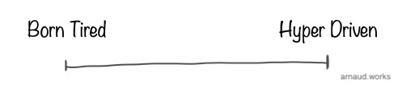

# The Pirate's Way
<baseline>How to build tech products and the teams behind them</baseline>

## [Read Me First](#readmefirst)
### [Disclaimer](#disclaimer)
### [Path to Success](#pathtosuccess)
### [Take-Away](#takeaway)

## [Concepts & Principles](#conceptsandprinciples)
### [Company's DNA](#companydna)
### [Trifecta](#trifecta)
### [People First and Last](#peoplefirstandlast)
### [Leadership vs Management](#leadershipvsmanagement)
### [Politics & Culture](#politics_culture)
### [Recruitment & Team Structure](#recruitment_team_structure)
### [Mindset beats Skills](#mindsetbeatsskills)
### [Knowledge is everywhere](#knowledge)
### [Cui Bono](#cuibono)
### [Motivation & Inspiration](#motivationandinspiration)
### [Owning the Zone](#owningthezone)
### [Product Sweet Spot](#productsweetspot)
### [Focus](#focus)
### [Product, Program, CX, CS and Delivery](#product_program_cx_cs_delivery)
### [UX vs UI](#uxvsui)

## [The Product](#theproduct)
### [R&D](#randd)
### [MVP](#mvp)
### [GM](#gm)
### [The never ending product](#theneverendingproduct)

## [The Team](#theteam)
### [Individual contributor](#individualcontributor)
### [Manager](#manager)
### [Director](#director)
### [VP](#vp)
### [C suite](#csuite)
### [Founder](#founder)

## [Make it your own](#makeityourown)

[pagebreak]

@#$readmefirst$#@
## Read Me First

Let's address the title. 

The attitude I like to promote is the one of people who are fearlessly navigating the metaphorical sea of high-tech believing in their ability to handle new challenges on a regular basis.
To do so, they develop the skills and the mindset to set their own rules, challenge the status quo and in the process accomplish things that were out of their reach before.
I call people who work this way, pirates. It's a mark of respect anchored in the old definition of hackers that started this entire industry ~50 years ago.

Now, what you're getting into. 

I've developed my methodology over the past ~20 years (and counting) working on very diverse environment building tech products. 
I've made countless mistakes, picked countless ridiculous battles and died on the dumbest hills you can imagine.
But along the way, I've also learned from my mistakes, met incredible people, learned from them and came up with a set of skills that allows me to tackle any tech product problem with confidence.

I've never put anything that would collect all these lessons together, as it was a very personal "playbook" I would only use when coaching or mentoring my staff, friends or clients.
This is because for me, most of this methodology is mostly build off pieces widely covered and available online for free.
At times, I thought it'd be good for me to have a reference somewhere, but still, I never pulled the trigger.

In the past few years, the demand for me to put something together has only increased in frequency.
I used to respond that it's all online. Gave a few names and left it to that, but I got convinced that like my composition is like a recipe: having access to the ingredients doesn't take away the value of the steps to bake the cake.

So here we are, this is the most detailed material I have written on my methodology to build tech products and the teams behind them.

@#$disclaimer$#@
### Disclaimer
I'm not a writer and not trying to be one. The style here isn't going to be mind-blowing as english isn't my native language.
My objective is to convey the knowledge I've acquired in the most succinct way.
I'm not a fan of long read with little meat to it, so I'm going to cut to the point as often as necessary. 
There is a lot of depth at times I will cover and the most important nuances lie in them, so bear with me when I take a tangent.
Ultimately, for the sake of efficiency, convenience and brevity, I will be making definitive statements throughout this content.
Remember, that everything here is implicitly wrapped with "in my opinion" and "in my experience". Don't take things too personally.

This is a live document I intend to modify as often and as extensively as necessary.
Follow me or come back often if you want to keep up with changes. I plan on posting updates on LinkedIn only because I don't want to manage too many social media accounts.
As you most likely are, I'm on my own learning journey.
As I pick up new things, I will be editing this document accordingly.

@#$pathtosuccess$#@
### Path to Success
Success isn't as straight forward as it's commonly portrayed. I'm sure you've seen this meme around:

This isn't the place to cover success as a whole, but it's important that you take a look in the mirror and find what it means to you.
Regardless, this document isn't about making you successful. It's about sharing the tools that allowed me and my teams to be successful under our own criteria. 

What drives me is building things. As big as possible, as fast as possible. I'm very curious and easily interested.
The more out of my comfort zone I am, the better, as it will present the best opportunity to overcome difficult problems and learn from the journey.
The collaboration between people, the personal growth of the individuals under me/next to me and overcoming things we didn't know were possible is my definition of success.
It's the high I chase, the satisfaction I take home. 

@#$takeaway$#@
### Take-Away
I think I've covered this well already, but I want to hammer this down.
What you should take away from this methodology is:

1. A renewed **interpretation of concepts** you may already be familiar with.

2. A sets of **principles** that structures your operations all the way to the day to day.

3. A sets of **processes** that will help reinforce the principles in a practical tangible way.

All these will shape your mindset. It won't be the end of the journey, but the beginning.
Keep in mind that knowing the path and walking the path are two very different things.

@#$conceptsandprinciples$#@
## Concepts & Principles

Let's start by covering concepts and principles. It will feel like a bit of a dumping ground, but you can come back to it in depth when I go over the product and team parts later.
Remember, principles are high level rules you force yourself to follow. This isn't a binary hard line either. 
It's more a 90% of the time hard, 10% soft on exception cases. 
This hard-ish stance is not to dumb your brain into following them like your new religion, but to force you to think if you're facing an exception when they get challenged.

Concepts are more relatable. Here they mean topics reviewed from a different angle. Often an unpopular one.
You may not like what you will read because you don't know me, don't know where I come from (intellectually and emotionally) and I completely flip some of these on their head relative to what you've probably been told for years and likely have come to deeply believe.

In the end, you're likely to end up taking either one of two paths. You'll either think I'm an idiot or you'll love what you read. It's never been in the middle somehow.
This is rule #1 in leadership (we'll get back to it), whatever you do, you will never be compatible with everyone. 
If you can't stand being hated, you won't be able to accomplish anything of significance.

@#$companydna$#@
### Company's DNA

A company's DNA is the most important thing to understand as early as possible. It's not always easy for private or unknown companies to figure out, and you may have to be inside the factory to see how the sausage is made.
Regardless, it will shape everything from the smallest detailed decision to the highest strategic one. It's often confused with culture but the DNA creates most of the culture, not the other way around.

I've seen this principle apply time and time again. I've been fighting company's DNA to some extent in pretty much every company I worked for.
It gets particularly difficult when the executive team is saying they are committed to a direction but their DNA is acting against it. 
Now this is super common in time of hardship. The team want to shake things up, but won't let go of their old ways, not realizing why. 
It's hard as well to cover because at the highest level, most people believe their success is due to their impeccable professionalism, their ice code rational and whatever makes them feel that everything they have is earned and luck had no play in it.

This DNA won't stop at this level though. It will express itself from every level of the company because many, if not most of the staff, is here because of that DNA - even if implicitly.
It usually translates in symptomatic expression of the DNA. For instance, people will want to work at the company because it has "a strong office culture" which in fact is only the expression of the micromanaging DNA the exec team is pushing.
There are plenty of valid reasons to have a full in-office workforce beyond micromanagement. That's not the point here.
The point is that the micromanaging DNA behind the office culture will express itself much further than the office culture. And you now may have to push against a secondary 'echo chamber' of that DNA with the work force defending it.

[pagebreak]

The company's DNA is the core principle that the team will always fall back to. 
It will be the core interests they have; the rules they obey by all means; the elements that ultimately defines their **identity**.
It's not always written in black and white. It's not always aligned with the advertised values. 
Most of the time, the values are an aspiration. A direction the team would want the DNA to be at.

It comes first and foremost from the founders.
If the founding team is non-technical, it can create a DNA of business first. This can translate into a DNA that diminishes the fine print difficulties of product and engineering - most typically the schedule slipping - and ultimately add frictions to everything while it becomes very difficult to explain the situation up.
On the other side, a technical founder can bring to the table a "I know it all" attitude and a strong preference for a given product line or market shaping the DNA of the company towards consumer electronics for instance and preventing a differentiation effort towards enterprise (or vice versa).

The next echo chamber is the executive team. They will most likely carefully mold themselves to please the founders through meticulous upward management.
Very, very often, the executives will aggressively, yet subtly nudge the DNA towards where the company can be the most fruitful. It may work (Steve Jobs convinced to do iPod on Windows) or it may fail. 
It's not uncommon to see exec move on to their next venture when they fail at this task. I've been there and I know many who have been there as well.

Then it is quickly followed as an echo chamber by what the company does, where it became successful. You'll hear conversation saying "We are X because product Y is our most successful one".
For instance, I heard many times regarding Apple: "We are a mobile company because all our best-selling devices are mobile devices."
And it's a truthful statement, because what you sell heavily defines your identity and your DNA. 

Now you've probably seen this circulating on social media:

Take a second and think about what's the DNA of each of these companies? Are their side businesses defining their DNA or just side-gigs?

[pagebreak]

Unfortunately for the idealist, a company is extremely unlikely to be able to develop multiple DNAs. 
This a broader topic I don't want to cover here, but conglomerates and acquisitions with retained autonomy (think of YouTube inside Alphabet) are valid paths towards it. 
On the other side, when you try to force two DNAs to merge, because it's unlikely to work, you can find strong clashes - like the recently reported issues between Slack and Salesforce.

Understanding the DNA and embracing its strength and limitation is critical as you will see that an important principle here is to constantly navigate just outside the boundaries of the possible. 
You want to be able to push everything forward in a realistic way, never delusional.

@#$trifecta$#@
### Trifecta

The trifecta is a work model - a core principle - that sets expectations, responsibilities and dynamics to build products effectively.
As it's name implies, it's structured around the **three roles** that are defining the **product, build it and deliver** it on time.

#### 1. Product - What?

Product is here to **figure out what should be built**. They answer the question **'What?'**.

There is a process-y way to go at this, but many companies (small and big, young and old) are being very successful with an organic approach, so it's not mandatory.
Don't torture yourself if you don't or can't do all the things below.

Here are some of the ways the Product role can find the answers to 'What?':

- **Market research** - Gartner quadrants, market analysis firms/reports, you name it. This is high level and frankly the company should have done this pre inception and maintain it up to date once in a while.
- **Product Marketing** - Customer surveys, usage analytics analysis, new revenue streams; anything the marketing team has collected in terms of next milestone. This or some of this can often be taken by product managers.
- **CS/CX (Customer Support/Success & Customer Experience)** - Not everyone has them, but if you do, they are often part of product, but they are strategically positioned to receive customer feedback on what works and what doesn't. Beware of the survivorship bias though.
- **Stakeholders** - Any other key stakeholders that has a problem, an interest and/or a demand. Can be operations, accounting, finance, compliance, and any of the other roles of the trifecta. Everything should be researched and validated.
- **Vision** - Now this is usually the part that everyone prefers. You YOLO ideas that make you feel great on reshaping the world as we know it. The less cynical way to look at it is, that this is the area where you define what the customer will want as they don't _trully_ know what they want. It is easily 80% of the work when working on bleeding edge technology (deep tech). Very often, this comes from the founders, expanding by product leadership and through a back and forth with the different product leaders in the org.

There are more ways of course. They will depend on the structure of influences in the company and which departments have a support or control function.
Regardless, successful outcome is a product line up, release structure, feature list with impact rankings.

#### 2. Engineering - How?

Now that we know what we want, it's time to work on building it. The engineers will do that by answering the question **'How?'**. 

Engineering will do just that while retaining the most important elements from Product.
This also means that the requirements from Product have to be sensible. To enforce this, the **Trifecta works _with_ each other not _for_ each other**.
This is a critical differentiation of the trifecta vs what you've probably heard before from structure that resembles it.

To figure out 'How?' Engineering will go and look at:

- **All stacks, Technologies and/or Providers** - Which language? which framework? Full native? Web? Firebase vs AWS? AWS vs Azure? Self-hosted? Bare metal? Contractors for dev work? Do we use Atlassian? Testrails for our QA?
- **Code base state** - Is this a pit? What is a code debt nightmare? What's a house of cards? What's the perfect API-based engine we have that can scale to infinity?
- **Skill set** - What skills do we have at what level of maturity?
- **Load and capacity** - Do we have enough high skilled people available to work on said work? If so or not, what's the rough timetable (Project will help here)
- **Current recruitment market conditions** - Consulting with HR, you get a sense of your upward expansion in talent to beef up? What's our turnover to have a new hire productive? How much of this is related to our stack?
- **Team dynamics** - What team is critical for the product dev? Are they up to speed? Are they at the right level of maturity?

Their decision-making may require architecture meetings, exploratory R&D and definitely iterations.
Ultimately, the success outcome is a multi-generational plan on how to balance new features, core technologies development and refactoring. (It goes deeper but not relevant here)

#### 3. Project - When?

The Project role has often other names like delivery and program management. There are differences noticeable but at the role level they don't matter.

Anyway, we finally know what we want to build and how we will build it. It's time to figure out **'When?'**. 

At this moment, Engineering is capable of giving time frames but these are notoriously unreliable.
That's because to provide accurate timeframe, you need perspective.
I'll go in the details later, but in a nutshell, you need some distance to see the entire picture and a certain detachments from outcomes.
This is functionally incompatible with what engineering needs: depth, focus and commitment.

Project isn't deciding how long something takes. Project allows Product and Engineering to come up to compromises by being a grounded sounding board to all dependencies at hand.
That's also why in mono-products like a single iOS app, you rarely need a project manager. Engineers will easily assume the role and do it well.

In bigger settings, Project coordinates all work from the individual teams to the cross-functional collaboration - sometimes with external stakeholder - it gets to see the entire dynamic at play.
Every meeting is an opportunity to identify conflicts in promises ("you said that..."), expectations ("I though ...") and responsibility ("I didn't know I was supposed to ..."); to make sure the progress is capture appropriately; to lay the work on roadmaps and timeframes.

Project is often the most powerful when the full owner the of project management tooling (Jira and alike). 
They work to continuously polish the process in place as to make sure every team speaks the same language.

Project will often either drive a meeting when there is a peer-to-peer coordination using soft skills. Project isn't the boss in the room, Project just wants information to be accurate.
Regardless of who runs the meeting, if Project is involved, it will act as a minute taker. They will then communicate to everyone the outcome. It's an important step that realigns everyone.

In a nutshell, Project can build the path to figure out 'When?' by:

- **Attend all stand-ups** - It gives it direct insight in how engineering is working. Direct opportunity to raise upcoming conflicts and issues
- **Run regular sync up with Product and Engineering** - This is to realign all expectation with the latest reality.
- **Kick off new work** - To make sure everyone is starting from the same point.
- **Own the project manager tooling** - To define and maintain the engineering workflow language across all teams. You don't want 10 teams with 10 different ways of working.
- **Communicate & document** - To set where timeframe are available and make sure everyone is working under the same expectations.

Ultimately, this work gives the answer to when will the work be done. And when done right, the successful outcome is information that is available at any given time with minor update delay (< 3 days).

[pagebreak]

The Roles aren't necessarily matching 1 to 1 with people. 
In smaller companies, theses are hats that a single or more people wear. 
In large entities, it's easier to have full departments behind these roles.

For the trifecta to be effective, you need to promote a healthy back and forth between the roles.
This is essential to adjust to the other roles' harder lines they may face.

As a rough schedule you can use is:

- Product <-> Engineering should meet once a week or every two weeks.
- Product <-> Project should meet once a week.
- Engineering <-> Project should meet daily or multiple times a week. Ideally, Project has people to be at daily stand-ups.

Last, remember that these roles don't report to each other. They are peers working together towards a common goal. 
They all need to carry their own weight so they all can do their individual work. They all depend on each other.

@#$peoplefirstandlast$#@
### People First and Last

Tech companies are built by people. Smart and creative people. Usually relatively more people than you would need in other companies because most of the automation other industries enjoy comes out of tech companies.
There is plenty of automation and improvements in tech companies, but it's a bottomless pit as all these tools either require more people to manage or simply provide a platform to the next round of problems.
Software is like that - and yes, hardware companies runs tons of software too, so they are on the same boat. 
Software is this infinite land that continuously expand past the point that anyone can mentally picture.
So you're forced to bring more and more people as you grow, so you can continue developing and maintaining your products.

Not only the surface is large, but the problems are very complex. Even if your product is simple, as it grows you'll inevitably need to segment it just to be able to maintain it.
This requires creating an architecture that rely on smaller pieces that interact with each other. Just so you can focus on the individual context of each piece.

You may be thinking that you can jsut keep your business small, but you take the chance of being swallowed by the competition.
Either nicely through an acquisition or nastily through irrelevance. This reality makes the push to grow an omnipresent force.

It's not the end of the world, but it's a dynamic you better get comfortable with. 
Usually, people close to engineering are well aware with this, but there is a new generation of tech leaders whose background isn't necessarily rooted in engineering.
These people tend to have a hard time to understand that every line of code you have is a liability you need to maintain.
They also tend to have a hard time accepting that code kinda ages like milk.

These two realities forces you to constantly rewrite what was written. 
The efficient way to do it is to leverage the people who know the code base in the first place as they carry with them the knowledge of the lessons learned building and shipping the product.
It's not a silver bullet though as some of them can stay stuck in the old ways.

Regardless, your people dynamic is now a **qualitative**, **quantitative** and **generational** (at the company level) problem to handle.

[pagebreak]

So by now, you probably get that my point is that people in your teams are incredibly important. 
This doesn't mean that you have to accept everything and anything, but it does mean that you **have to go above and beyond** to find resolutions, to stimulate the environment they work in. 
You have to leave behind your ego, feelings and assumptions behind. You have to put yourself in their shoes.

- In situation of under performance, you start asking why? You assume there is a legitimate problem. Read more from Simon Sinek if you want to deep dive this topic.
- In cases of conflicts, you focus on getting all sides perspective first. You protect fairness, leave your 'favorite child' biases behind.
- In any circumstances, you focus on providing perspective so everyone understand why they are here. You put yourself in their shoes.

A practical example that's also been widely documented is founders/executives with heavy equity in their compensation not understanding/accepting low engagement from their staff.
They don't have the same skin in the game as you have. Give it to them or just accept the dynamic you've established.

[pagebreak]

Finally (for now), tech talent has the upper hand. They are in high demand pretty much everywhere in the world. The good ones even more. 
They get approached all the time with new opportunities and that's another dynamic you need to get comfortable with.
Once again, it doesn't mean you have to accept everything and anything. It does mean you need to understand the true nature of your relationship.
The large majority of them don't want to job hop every few months. They want to be paid fairly, work on interesting problems in an environment that is pleasant and compatible with their personal development.

Just don't give them a reason to leave. Give them a reason to stay or join.

@#$leadershipvsmanagement$#@
### Leadership vs Management

The difference between leadership and management is a subject I particularly appreciate. 
They are so often used as synonym and the term 'lead' is so commonly used as a blanket placeholder to rightful titles in insecure environments.
Still, there are _very_ big differences that have to be understood to **build world-class teams** though.

[pagebreak]

#### Management, the art of creating predictable results

To achieve predictable results, the manager (at any level) leverages **different processes and tools** that have demonstrated - in their context - their ability to do so. 
This includes scheduling, workflows or pipelines with checkpoints at given key frames. 

Anyone can basically be a good manager providing that they can structure their work and be organized. You simply have to engage in a control loop:

1. Start by identifying a **problem**. This is obviously easier if you've done the job below the manager, but it shouldn't be crazy hard either way.
2. You start identifying a **solution**. This is a research project. You can get answer from the internet, your network, personal experiences or brainstorming.
3. You deploy the solution and **observe** the results. This is simply organization and discipline. There are ways to get better at each of these steps, but I'll cover that later.

After that last step, based on the observed results, you go back to step 1, moving to the residual problems. Rinse and repeat.

Great managers get good and predictable results, but the tech industry being such a talent-driven one, if you are looking for excellence, a pure management approach tends to fall short. 
This is where leadership comes in.

[pagebreak]

#### Leadership, the art to guide others to their excellence

Everything else that is usually attributed to leadership is consequential to this. Now, there are countless leadership styles, but that's not exactly the angle I want to cover here.

Leadership is about bringing **inspiration and direction** to a bright future while also providing **individually-tailored guidance and support** to get there.
In other words, you set the north star, get people rallied behind your ability to take everyone there and take care of each individual along the way.

It's more difficult than management because it requires strong **soft skills**. You have to be confident and capable to put yourself in your people's shoes. 
You need to be able to genuinely connect with the people you interact with to effectively lead. You need to genuinely care about them.

In practice, the rise of leadership skills is rarely structured and much more natural selection oriented. 
Many strong leaders have a natural sense for their style and this tends to create a natural matching selection where you - as leader - attract people that are compatible with your style and reject those who aren't. 
This is something you should be aware of as you will be missing on some incredible talent and ideas.
This is also very relevant if you find yourself being the only genius in the room and there is a book about that I believe called "Everyone is an idiot" (but I haven't read it yet - was recommended for this topic)

So great leadership requires:

1. Strong **soft skill**, 
2. The ability to **connect with people**, 
3. A sense of **confidence** but also the ability to **question yourself** constantly.

Leading by example is an obvious step you have to follow. If you live by "do what I say, not what I do", you will lose respect faster than you can blink. 

Ultimately, if you are capable of providing the right level of guidance and support to your people, you will start seeing that the people you work with are giving you **a lot more** that what you'd have under a plain management structure. 
I'm talking **better, fresher ideas; an always switch-on attitude; a stronger internal drive; positive/can-do attitude; loyalty and commitment; and so much more**. 
Also, this energy is **contagious**. As you now lead a team of people who are inspired to take on the impossible, you attract better talent too.

Leadership is not all natural, it can be learned. It is a longer and more difficult journey than management because it requires you to do a lot of work on yourself.
That is, if you want to excel at the task, which is definitely not the majority of leaders out there.
Even notoriously famous leaders that have achieved great goals tend to exhibit a version of 'walk or die to my style' attitude.
It does work, but you should be better.

Good leadership is the number one differentiator between teams who do excellent, pioneering level of work and those who just run a decent product/company. 
I'd choose a poorly managed company with great leadership any day versus the opposite. 

[pagebreak]

#### Leadership and Management throughout your career

As you climb the ladder on the people management style, the importance of leadership and management changes.
Even at the individual contributor level, management and leadership skills matter, but they are a nice to have, so I'm not going to dive too deep into it now.

At first, as a manager, you'll need much high 'great management skills' to 'great leadership skills' ratio. This is because your job is first and foremost to organize the work of the people underneath you.
As you progress, the balance progressively shifts because you have more and more people underneath you that are handling the management and the expectations shifts towards autonomy and the ability to take on higher and higher level requirements.
At the top, you are becoming 'one of the few'. You must be inspiring, you must convey the energy that is making the list of reasons as to why people join and stay.

In a nutshell, it kinda follows this graph:

[pagebreak]

As you can see, the difference matter, because it's two sets of skills that needs to be worked on independently. 
If you believe there are the same, you are likely not to work on both but simply the one that you think represents both in your mind.

@#$politics_culture$#@
### Politics & Culture

Coming Soon...

@#$recruitment_team_structure$#@
### Recruitment & Team Structure

Coming Soon...

@#$mindsetbeatsskills$#@
### Mindset beats Skills

Coming Soon...

@#$knowledge$#@
### Knowledge is everywhere

Coming Soon...

@#$cuibono$#@
### Cui Bono

[//]: # (Here talk about what's in it for me. )

Coming Soon...

@#$motivationandinspiration$#@
### Motivation & Inspiration

Motivation is the force we all have within to do things. It differs from inspiration as it's about doing things we know we can do while inspiration is showing you the things you thought were unattainable are actually within reach.

You can't teach motivation. You can stimulate it and you can protect it. 
You can easily destroy it. If through your actions - at any level - you convey that it (whatever 'it' is) is not worth pursuing, you will destroy the motivation people had to pursue things.

@#$owningthezone$#@
### Owning the Zone

Coming Soon...

@#$productsweetspot$#@
### Product Sweet Spot

[//]: # (![Product Gauge]&#40;./images/product_gauge.jpg&#41;)
Coming Soon...

@#$focus$#@
### Focus

Coming Soon...

@#$product_program_cx_cs_delivery$#@
### Product, Program, CX, CS and Delivery 

Coming Soon...

@#$uxvsui$#@
### UX vs UI

Coming Soon...

@#$theproduct$#@
## The Product

Coming Soon...

@#$randd$#@
### R&D

Coming Soon...

@#$mvp$#@
### MVP

Coming Soon...

@#$gm$#@
### GM

Coming Soon...

@#$theneverendingproduct$#@
### The never ending product

Coming Soon...

@#$theteam$#@
## The Team

Coming Soon...

@#$individualcontributor$#@
### Individual contributor

Coming Soon...

@#$manager$#@
### Manager

Coming Soon...

@#$director$#@
### Director

Coming Soon...

@#$vp$#@
### VP

Coming Soon...

@#$csuite$#@
### C suite

Coming Soon...

@#$founder$#@
### Founder

Coming Soon...

@#$makeityourown$#@
## Make it your own
This methodology is heavy on principles/concepts and light on processes because it is designed to be adaptable to all situations.
Any team sizes, any company sizes, any product type, any markets.
You become adaptable when you develop a mindset. A mindset will allow you to process the same information as other with a different look on it and ultimately, a different action.
Well understood principles will do that. Step-by-step process won't.
I still see on a regular basis way too many managers and executives who use a one-size-fits-all approach and don't understand why the results aren't coming.
That's because step-by-step processes tend to create one trick ponies. Don't let yourself become one.

Regardless of where you learn something - and this applies here as well - adopt the knowledge as your own.
You have to select what suits best the environment you're in and the person you are.
Make it your own. Adopt progressively and selectively. Start with what you are the most comfortable with and allow yourself to try and fail.
In the end, you want your own style/method to come out and your personality to be preserved, not suppressed.

You would probably be surprised about how often I still have to make this point to young managers/leads who are firmly believing or acting like they need to become someone else to succeed.
